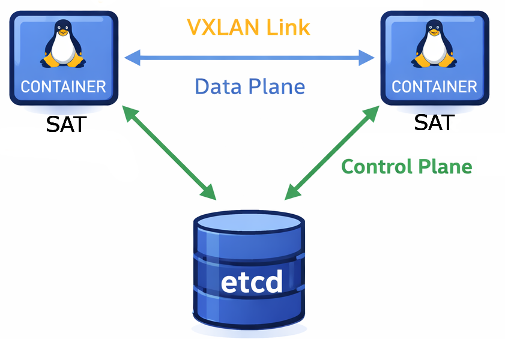

<div align="center">


# **NetSatBench**  
## *Large-Scale Satellite Network Benchmarking System*  

</div>

**NetSatBench** is a distributed emulation framework for evaluating communication and application workloads across large-scale satellite constellations. It provides a scalable Layer 2 (L2) network substrate on which arbitrary routing protocols and applications can be deployed without modification.

Emulated systems are made of satellites, ground stations and user terminals, whose nodes are implemented as **Linux containers**, across a cluster of machines, enabling high degrees of parallelism and scalability.  
VXLAN tunnels form a dynamic **L2 network fabric** interconnecting emulated nodes with specific link characteristics (e.g., latency, bandwidth, delay) to mimic real-world satellite network behavior.

NetSatBench is **L3- and application-agnostic**. Any routing protocol (e.g., OSPF, BGP, IS-IS) or user-defined application (e.g., iperf, traffic generators, analytics workloads) can run directly over the emulated constellation. IS-IS routing is supported out-of-the-box via [FRR](https://frrouting.org/).

---

##  Emulation Architecture


**Distributed Execution and Control**  
   Emulated nodes of the satellite system are instantiated across a cluster of hosts (bare metal or virtual machines), named workers. Each emulated node manages its own lifecycle and configuration through an internal agent, called `sat-agent`, which continuously enforces the desired network and computing state stored in an Etcd key-value store whose information is updated at run time to follow system dynamics by a dedicated control host. The format and semantics of the Etcd keys used by NetSatBench are described in the [JSON format documentation](docs/json-format.md).

**Dynamic L2 Fabric**  
   Node-to-node links, such as inter-satellite links (ISLs) and satellite-to-ground links (SGLs), are represented as VXLAN tunnels that are dynamically created and managed by each node’s sat-agent, based on the global system state stored in Etcd. This design provides seamless Layer-2 connectivity, independent of the container placement within the cluster.

**Scalability Through Distribution**  
   By distributing containers across multiple hosts and using publish-subscribe messaging via Etcd, the emulation scales to thousands of satellite system nodes without overloading any single machine. Each worker runs multiple containers, each representing a satellite, ground station, or user terminal, with its own networking stack and sat-agent.

**Built-in Configurable IP Routing Support**  
   FRRouting (FRR) over the L2 VXLAN fabric is natively supported. At link creation and deletion, each sat-agent can optionally invoke an user-provided routing configuration utility to update the routing daemon configuration or performing other specific routing action. A buil-in IS-IS routing configuration utility is provided to configure IS-IS routing using FRRouting (FRR). The description of the utility and its integration with the sat-agent is provided in the [routing-interface documentation](docs/routing-interface.md) section.

**User Applications Life Cycle**  
   Any application or tasks can be executed inside the emulated nodes at a specific time defined in the Etcd key-value store. The sat-agent continuously monitors the command queue in Etcd and executes user-defined commands inside the container, enabling dynamic application deployment and execution across the emulated nodes of the satellite system.

**Physics-Driven Networking**  
   Link parameters are derived from orbital mechanics and line-of-sight geometry, ensuring realistic performance evaluation.

---

## 📁 Repository Structure

**control/**  
Contains Python scripts responsible for constellation-wide orchestration, including cluster configuration and the deployment and run-time evolution of the constellation.

**sat-container/**  
Contains the software used to build the container image for each emulated  node of the satellite system.

**test/**  
Contains sample emulated satellity systems used for validation and benchmarking. The configurations are defined in JSON format described in this [document](docs/config_format.md).

**docs/**  
Contains documentation assets, including images and architectural diagrams.


## 🛠️ Cluster Architecture 


The cluster used for emulation is made of two types of hosts: 

- **control host**
- **workers**

An host of the cluster can act as both control host and worker. 

Typically, control host and workers are Linux virtual machines or bare-metal servers connected by an 10+ gigabit ethernet. In our experiments, we used OpenStack virtual machines with Ubuntu 24.04.

>**No IP Spoofing:** VXLAN tunnels use the IP addresses of the corresponding container eth0 interface as tunnel endpoints. As a result, the underlying network must permit direct IP connectivity between container subnets (`sat-vnet`) running on different worker hosts, without IP spoofing protection mechanisms. Consequently, in cloud environments, any security restrictions applied to host network interfaces must allow traffic among all container subnets (`sat-vnet-supernet`).

## 📱 Software Requirements

### Control Host

The control host must have SSH access to all workers using key-based authentication.  
It is responsible for executing control scripts and running an instance of the **etcd** key-value store, which maintains the global state of the emulated satellite system.

The following software must be installed on the control host:
- **Etcd** — distributed key-value store used for global state coordination  
- **Python 3** — with dependencies specified in `requirements.txt`
- **SSH Client** — for remote connections to worker hosts
- **control and test folders** — the contents of these folders must be present on the control host to run the orchestration scripts and define the emulated satellite systems.

---

### Workers

Workers are Linux hosts on which emulated nodes of the satellite system, namely Linux containers, are instantiated.

Each worker must allow passwordless `sudo` access for the SSH user used by the control host to connect remotely. This allows the control host to execute necessary `iptables` commands on the workers allowing emulated nodes to interact with each other without any NAT function. 

Additionally, the following software must be installed:
- **Docker** — used to run containerized emulated nodes. The SSH user must be permitted to execute Docker commands (i.e., be a member of the `docker` group)
- **SSH Server** — to allow remote connections from the control host

## ⚡ Quick Start

Deploying a satellite system made of 10 nodes across your cluster.
The example below assumes that you have already set up the control host and workers according to the software and network requirements specified above.

The sample configuration files used in this quick start are in [test/10nodes](test/10nodes). The cluster is made of 2 workers, named 'host-1' and 'host-2' specifird in the [workers-config.json](test/10nodes/workers-config.json) file.

The emulated satellite system consists of 9 satellites and 1 ground station, as specified in the [constellation-config.json](test/10nodes/constellation-config.json) file. 

The evolution of the constellation is in the `epoch files` files in [test/10nodes/constellation-epochs](test/10nodes/constellation-epochs) directory, which specifies link dynamics (add, update del), and application workloads to be configured at the specific epoch time.

1. **Customize Configuration:**  
    Download or clone the repository to the control host.
      - Navigate to the `test/10nodes/` directory and modify the `workers-config.json` file to specify the IP addresses of your worker hosts, along with the ssh paramenters used for remote connections from the control host.
      - Modify the `constellation-config.json` file to define the desired node deployment on workers by modifying the node key `worker`.
3. **Cluster Configuration:**  
   From the control host, run the `system-init-docker.py` script to set up the network environment of the workers.
   ```bash
   python3 control/system-init-docker.py --config ./test/10nodes/workers-config.json
   ```
4. **Initialize, Deploy and Run the Emulated Satellite System:**  
   Execute the `constellation-init.py` script to initialize the constellation state in the Etcd key-value store.
   ```bash
   python3 control/constellation-init.py --config ./test/10nodes/constellation-config.json
   ```
   Execute the `constellation-deploy.py` script to deploy the nodes of the emulated satellite system across the cluster as specified in 
   the init configuration.
    
   ```bash
   python3 control/constellation-deploy.py
   ```

   Finally, after a couple of seconds to ensure all containers are up and running, run the `constellation-run.py` script to start the emulation, which will evolve the system state over time according to the epoch files.
   ```bash
   python3 control/constellation-run.py
   ```
   
5. **Monitoring and Interaction:**  
   You can monitor the status of the emulated nodes and their network by connecting directly to the containers on the workers via SSH. For example, to access a satellite container named `sat-1` on `host-1`, use:
   ```bash
   ssh user@host-1 docker exec -it sat-1 /bin/bash
   # inside the container, you can run commands like:
   ip addr show
   ip route show
   ping grd1   
   ```
   Note that `user` should be replaced with the actual SSH username configured on the worker host. Note also that, within a container, you can reference emulated node by name (e.g., `grd1` for ground station 1). 
6. **Cleanup:**  
   After completing your experiments, you can clean up the emulated satellite system by running the `constellation-rm.py` script, which will remove all containers from workers and clear the Etcd state.
   ```bash
   python3 control/constellation-rm.py
   ```
   Then , you can optionally run the `system-cleanup-docker.py` script to remove any residual configurations on the workers. This step is necessary if you plan to run another emulation with different worker settings. Otherwise, you can skip this step.
   ```bash
   python3 control/system-cleanup-docker.py
   ``` 