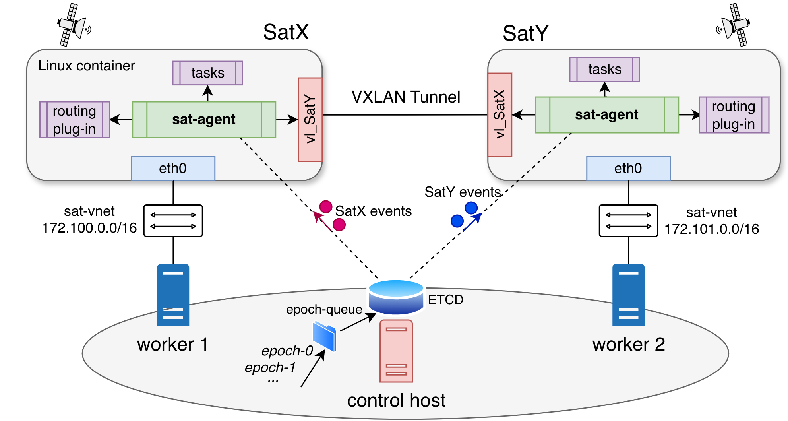

<div align="center">


# **NetSatBench**  
## Large-Scale Satellite Network Benchmarking

</div>

**NetSatBench** is a distributed emulation framework for evaluating communication and application workloads over large-scale satellite constellations.

Emulated systems consist of satellites, ground stations, and user terminals, each implemented as a **Linux container** and distributed across a cluster of bare-metal or virtual machines. This design enables a high degree of parallelism and scalability.  

The satellite network is implemented as an overlay Layer-2 fabric whose links (satellite-to-satellite and satellite-to-ground) are **VXLAN tunnels** dynamically created and managed by each emulated node in a complete distributed and scalable manner. Each link can be configured with realistic performance characteristics (e.g., latency, bandwidth, loss) to reproduce real-time satellite network behavior.  

NetSatBench is **Layer-3 and application agnostic**: any routing protocol (e.g., OSPF, BGP, IS-IS) or user-defined application (e.g., iperf, ping, analytics workloads) can run unmodified over the emulated constellation. IS-IS routing is supported out of the box via [FRRouting (FRR)](https://frrouting.org/), event though its stability strongly depends on the constellation dynamics.

---

## 🧩 Emulation Architecture

<div align="center">

</div>

### Distributed Execution and Control
Emulated nodes are instantiated across a cluster of hosts (bare metal or virtual machines), referred to as *workers*. Emulated nodes manage their own lifecycle and configuration through an internal agent, called `sat-agent`.  
Any `sat-agent` continuously enforces the desired network and computing state of the related node through publish-subscribe interactions with an **Etcd distributed key-value store**, whose contents are updated at run time to reflect system dynamics.   

### Dynamic L2 Fabric
Node-to-node links, such as inter-satellite links (ISLs) and satellite-to-ground links (SGLs), are modeled as VXLAN tunnels dynamically created and managed by each node’s `sat-agent`, based on the global system state stored in Etcd.  
This overlay network provides seamless **Layer-2 connectivity** among emulated nodes, independent of container placement within the cluster.

### Scalability Through Distribution
By distributing containers across multiple hosts and relying on publish–subscribe coordination via Etcd, NetSatBench can scale to thousands of emulated nodes with modest resource requirements per host. 
Each worker can host hundreds of containers, each representing a satellite, ground station, or user terminal. A raw emulated node, without user applications and with FRR daemon, typically requires less than 50 MB of RAM and minimal CPU resources when idle. We have successfully run emulations with 100 emulated nodes per worker with 8GB of RAM and 4 CPUs.

### Extensible IP Routing Support
Upon link creation or removal, each `sat-agent` may invoke, through a Python interface, a user-provided IP routing module. This module is responsible for updating the routing daemon or performing custom routing actions over the VXLAN fabric.
A built-in IS-IS routing [module](sat-container/extra/isis.py) for FRR is provided, illustrating the design of such modules and their integration with the `sat-agent` via the specified Python interface.

### On-board Tasks and Application Execution 
User-defined applications and/or tasks can be loaded on the node payload as `sidecar` containers and scheduled for execution inside emulated nodes at specific times. Each `sat-agent` continuously monitors new commands to run from Etcd and executes them inside its containers, enabling dynamic application deployment and execution across the emulated satellite system.

### Physics-Driven Networking (Working in Progress)
Link parameters are derived from orbital mechanics and line-of-sight geometry, enabling realistic and reproducible performance evaluation.

---

## 📁 Repository Structure

**control/**  
Python scripts implementing constellation-wide orchestration, including cluster configuration and run-time control of constellation evolution.

**sat-container/**  
Software used to build the container image for each emulated node of the satellite system.

**examples/**  
Sample emulated satellite systems used for validation and benchmarking. Configurations are specified in JSON format as described in this [Configuration Manual](docs/configuration.md).

**utils/**  
Utility scripts for analysis, routing and data processing.

**docs/**  
Documentation assets, including images, diagrams, and architectural descriptions.
- [Configuration Manual](docs/configuration.md) — how to define and customize emulated satellite systems
- [Routing Interface](docs/routing-interface.md) — specification of the routing module interface
- [Etcd Key-Value Store](docs/etcd.md) — structure and organization of the Etcd key-value store used for constellation state management
- [Oracle Routing Module](docs/oracle-routing-module.md) — description of the built-in oracle routing [module](utils/oracle-routing.py) for shortest-path routing with make-before-break strategy.

---

## 🛠️ Cluster Architecture

The emulation cluster consists of two logical host roles:

- **control host**
- **workers**

A single physical or virtual host may act as both control host and worker.

In typical deployments, control and worker hosts are Linux virtual machines or bare-metal servers connected via a 10 Gbps (or higher) Ethernet network.  
In our experiments, we used OpenStack virtual machines running Ubuntu 24.04.

> **No IP Spoofing**  
> VXLAN tunnels use the IP addresses of the containers’ `eth0` interfaces as tunnel endpoints. Therefore, the underlying network must allow direct IP connectivity between container subnets (`sat-vnet`) across different worker hosts, without IP spoofing protection mechanisms.  
> In cloud environments, this implies that security policies applied to host interfaces must allow unrestricted traffic among all container subnets (`sat-vnet-supernet`).

---

## 📱 Software Requirements

### Control Host

The control host must have SSH access to all workers using key-based authentication.  
It executes orchestration scripts and runs an instance of the **Etcd** key-value store, which maintains the global state of the emulated satellite system.

Required software:
- **Etcd** — distributed key-value store for global state coordination  
- **Python 3** — with dependencies specified in `requirements.txt`  
- **SSH client** — for remote connections to workers  
- **control/** and **examples/** directories — required to run orchestration scripts and define emulated constellations

---

### Worker Hosts

Workers are Linux hosts on which emulated nodes (Linux containers) are instantiated.

Each worker must allow passwordless `sudo` access for the SSH user used by the control host. This enables the execution of required `iptables` commands to permit direct inter-container communication without NAT.

Required software:
- **Docker** — for running containerized emulated nodes. The SSH user must be a member of the `docker` group  
- **SSH server** — to allow remote access from the control host

---

## ⚡ Quick Start

Download or clone the repository on the control host and follow these steps to deploy and run a sample emulated satellite system. Be careful to meet all software requirements on both control and worker hosts previously described.

The sample configuration files are located in [`examples/10nodes`](examples/10nodes).  
The cluster consists of two workers, `host-1` and `host-2`, defined in [`workers-config.json`](examples/10nodes/workers-config.json). For simplicity, `host-1` has also the role of control host.

The emulated system includes 8 satellites, 1 ground station and 1 user, as defined in [`sat-config.json`](examples/10nodes/sat-config.json).  
Constellation dynamics (link creation, updates, removal, and task execution) are specified through epoch files located in [`examples/10nodes/constellation-epochs`](examples/10nodes/constellation-epochs). The ground station `gdr1` run an `iperf3` server starting at the initial epoch.

### 1. Customize Configuration
- Edit `workers-config.json` to specify worker IP addresses and SSH parameters.
- Edit `sat-config.json` to define node placement by setting the `worker` field for each node.

### 2. Cluster Initialization
From the control host, configure the environment variables necessary to access the Etcd store from the control host and the workers:
```bash
export ETCD_HOST="10.0.1.215" # IP address of the control host, where Etcd runs. Change as needed.
export ETCD_PORT="2379" # Default Etcd client port. Change as needed.

# Optional authentication parameters:
export ETCD_USER="username" # Etcd username, if authentication is enabled. Change as needed.
export ETCD_PASSWORD="password" # Etcd password, if authentication is enabled. Change as needed.
export ETCD_CA_CERT="/path/to/ca.crt" # Path to Etcd CA certificate, if TLS is enabled. Change as needed.

```

Configure the worker networking environment:
```bash
python3 control/system-init-docker.py --config ./examples/10nodes/workers-config.json
```

### 3. Initialize, Deploy and Run the Emulated Satellite System
Execute the `constellation-init.py` script to initialize the constellation state in the Etcd key-value store:
```bash
python3 control/constellation-init.py --config ./examples/10nodes/sat-config.json
```
Then, execute the `constellation-deploy.py` script to deploy the emulated satellite nodes across the cluster according to the initialization configuration:
```bash
python3 control/constellation-deploy.py
```
Finally, wait a few seconds to ensure that all containers are fully up and running, and then execute the `constellation-run.py` script to start the emulation.
The system state will evolve over time according to the epoch files:
```bash
python3 control/constellation-run.py --loop-delay 60
```
   
### 4. Monitoring and Interaction
You can monitor the status of the emulated nodes and their network by connecting directly to the containers running on the worker hosts via SSH.
The easier way is to use the `utils/constellation-exec.py` script, which simplifies the connection process.

For example, to run a bash on a satellite container named `usr1` use:
```bash
python3 utils/constellation-exec.py -it usr1 bash
```


### 5. Cleanup
After completing your experiments, you can remove the emulated satellite system by running the `constellation-rm.py` script.
This script removes all containers from the worker hosts and clears the Etcd state:
```bash
python3 control/constellation-rm.py
```
Optionally, you may run the `system-cleanup-docker.py` script to remove any residual configuration from the worker hosts.
This step is required only if you plan to run another emulation with different worker settings; otherwise, it can be skipped:
```bash
python3 control/system-cleanup-docker.py
```
