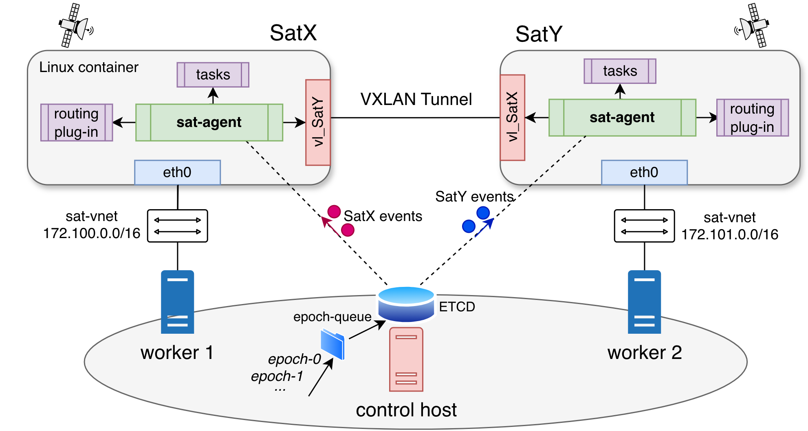

<div align="center">


# NetSatBench

## Distributed LEO Constellation Emulation

</div>

NetSatBench is a distributed emulation platform for evaluating communication protocols and application workloads over large-scale LEO satellite systems.

It emulates satellites, gateways, and user terminals as Linux containers distributed across worker hosts, and emulated links are realized through a VXLAN-based Layer-2 overlay. Time-varying system dynamics are driven by JSON epoch files and coordinated through Etcd.

NetSatBench offers a declarative JSON + Command-Line Interface workflow, while keeping routing and physical-layer modeling extensible through plug-ins.

---

## Core Features

- Distributed container-based emulation for large constellations
- VXLAN Layer-2 overlay for ISL, satellite to ground links
- Epoch-driven topology and task updates through Etcd and JSON files
- Declarative scenario definition with JSON files
- Plug-in interfaces for routing and physical-layer models
- Built-in support for IPv4 and IPv6 auto-assignment
- Built-in routing plug-ins, including IS-IS (IPv4/IPv6) and oracle routing
- Built-in physical-layer plug-ins, including StarPerf-based ISL models and simple parametric models for satellite-to-ground links
- Unified operational CLI (`nsb.py`) for init, deploy, run, monitor, and data transfer

---

## Architecture Overview

<div align="center">

</div>

The control plane has three components:

- `Etcd` as the global emulation state store
- A `sat-agent` inside each node container, subscribing to node-relevant state and applying local changes (link setup, traffic control, task execution)
- A control host running `nsb.py` to initialize, deploy, run, and monitor experiments

The data plane is a distributed Layer-2 VXLAN overlay among containers. Link characteristics such as delay, rate, and loss are enforced with Linux traffic control.

---

## Emulation Model

NetSatBench organizes execution into epochs. Each epoch file describes:

- Epoch start time
- Link additions, updates, and deletions
- Commands to run on selected nodes

The `nsb.py run` CLI pushes these updates into Etcd, and only affected `sat-agent`s react to each change.

Supported execution styles:

- Discrete-time replay of pre-generated epoch files (repeatable experiments)
- Real-time injection via epoch queue (digital twin style)

---

## Repository Structure

- `control/`: orchestration and runtime control logic
- `sat-container/`: container image and `sat-agent` code
- `generators/`: scenario and epoch generation tools
- `examples/`: sample scenarios and configurations
- `utils/`: utility scripts
- `docs/`: command and configuration documentation
- `test/`: experiments using NetSatBench

Main docs:

- [CLI Emulation Control](docs/control-commands.md)
- [CLI Utilities](docs/utils.md)
- [Configuration and Epoch Files](docs/configuration.md)
- [Etcd Key-Value Store](docs/etcd.md)
- [Scenario generation and Physical-Layer Plug-ins](docs/starperf-integration.md)
- [Routing Plug-ins](docs/routing-interface.md)
- [Cloud Deployment Notes](docs/cloud-notes.md)


---

## Requirements

### Control Host

- Linux host with SSH access to all workers (key-based)
- Python 3 + dependencies in `requirements.txt`
- Etcd instance reachable by control host and workers

### Worker Hosts

- Linux hosts with Docker
- SSH server enabled
- SSH user with passwordless `sudo` (required by setup/cleanup operations)
- Docker access for SSH user (membership in `docker` group)

### Network Prerequisite

The underlay network must allow direct connectivity among container subnets used for VXLAN endpoints (no anti-spoofing rule blocking container-source traffic).

---

## Quick Start

### 1. Clone and prepare

```bash
git clone https://github.com/mSvcBench/NetSatBench.git
cd NetSatBench
git submodule update --init --recursive
python3 -m pip install -r requirements.txt
```

### 2. Set Etcd environment

```bash
export ETCD_HOST="10.0.1.215"
export ETCD_PORT="2379"
```

Optional (if auth/TLS is enabled):

```bash
export ETCD_USER="username"
export ETCD_PASSWORD="password"
export ETCD_CA_CERT="/path/to/ca.crt"
```

### 3. Edit worker configuration

Update:

- `examples/10nodes/workers-config.json`

Set worker IPs, SSH user/key, and worker resource/network fields.

### 4. Initialize worker environment

```bash
python3 ./nsb.py system-init-docker --config ./examples/10nodes/workers-config.json
```

### 5. Initialize scenario state

```bash
python3 ./nsb.py init --config ./examples/10nodes/sat-config.json
```

This phase validates scenario inputs, assigns resources/IPs (if auto-assignment is enabled), schedules nodes on workers, and writes configuration into Etcd.

### 6. Deploy node containers

```bash
python3 ./nsb.py deploy -t 8
```

### 7. Run epoch-driven emulation

```bash
python3 ./nsb.py run
```

---

## Example Interaction

Run commands on nodes:

```bash
# Connect to node terminal
python3 ./nsb.py exec -it usr1 bash
# Check routing table
python3 ./nsb.py exec usr1 ip route show
# Run iperf3 test from usr1 to grd1 for 30 seconds with 2 second intervals
python3 ./nsb.py exec usr1 iperf3 -c grd1 -t 30 -i 2
```

Upload files:

```bash
# Upload llocal dir to usr1:/app
python3 ./nsb.py cp mydir/ usr1:/app
# Upload local dir to all user nodes
python3 ./nsb.py cptype mydir/ user:/app
```

See all commands in [CLI documentation](docs/contro-commands.md).

---

## Cleanup

Remove emulated nodes:

```bash
python3 ./nsb.py rm -t 8
```

Optional cleanup of worker-side setup:

```bash
python3 ./nsb.py system-cleanup-docker
```

---

## Reference

- *NetSatBench: A Distributed LEO Constellation Emulator with an SRv6 Case Study* (https://arxiv.org). Code used for the paper is available in the [`/test/handover`](/test/handover`) directory.
