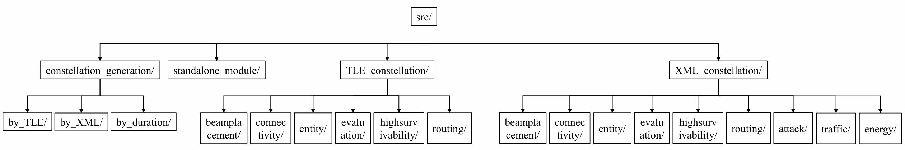

# 1. Introduction

StarPerf 2.0 is a feature-rich, highly open, and easily extensible constellation performance simulation platform. The platform architecture is 

**<span style='color:red;font-size:40px;'>"framework + plug-in"</span>**

that is: we have built a basic framework, which is used to implement various underlying functions of StarPerf 2.0 and provides a unified programming interface API to the outside. Various specific functions of the platform exist in the form of plug-ins, which are written based on the API provided by the framework. In this system, plug-ins and framework are decoupled, so StarPerf 2.0 is highly open and easily expandable.

StarPerf 2.0 supports two ways to build a constellation: the first way is to use XML configuration files to build a Walker-δ constellation, and the second way is to use TLE data to build a real constellation (Starlink, etc.).

Currently, we have provided a variety of functional plug-ins, such as the constellation connectivity mode plug-in "+Grid", the constellation routing strategy plug-in "Shortest Path Routing", the constellation high survival simulation plug-in "Solar Storm Damage Model", etc. 

Of course, you can also write the functional plug-ins you are interested in based on the interface API provided by the framework to achieve personalized functions. The remainder of this document is used to introduce various API interface specifications provided by the framework so that you can better use StarPerf 2.0 to complete your simulation tasks.

# 2. Environment & Dependencies

<a id="EnvironmentAndDependencies"></a>

Before we begin, we first introduce the operating environment of StarPerf 2.0 and its dependent libraries so that you can install StarPerf 2.0 correctly.

It is developed based on Python 3.10, so we recommend that your **Python version is 3.10**. In addition to the Python 3.10 standard library, it also uses the following open source Python third-party libraries:

**Table 1 : third-party Python libraries and versions**

|      Library       | Version |
| :----------------: |:-------:|
|         h3         | 4.0.0b2 |
|        h5py        | 3.10.0  |
|       numpy        | 1.24.4  |
|      openpyxl      |  3.1.2  |
| importlib-metadata |  6.8.0  |
|      skyfield      |  1.46   |
|        sgp4        |  2.22   |
|       pandas       |  2.1.0  |
|     poliastro      | 0.17.0  |
|      astropy       |  5.3.3  |
|      networkx      |   3.1   |
|      requests      | 2.31.0  |
|      jenkspy       |  0.4.0  |
|     pyecharts      |  2.0.4  |
|     global_land_mask      |  1.0.0  |

The third-party Python libraries in the above table and their corresponding version numbers are all listed in "docs/third-party_libraries_list.txt" in the form of "LibraryName==LibraryVersion" (such as "numpy==1.24.4"), and you can execute the 

**<span style='color:red;font-size:20px;'>"pip install -r docs/third-party_libraries_list.txt"</span>** 

command in the root directory of the StarPerf 2.0 project to install all third-party Python libraries at once.

Finally, StarPerf 2.0 does not depend on any non-Python environment, so you do not need to install any third-party orbit analysis/calculation tools (STK, etc.).

# 3. Architecture

The first-level architecture of StarPerf 2.0 is as follows :


The functions of each first-level module in the above figure are as follows : 

**Table 2 : StarPerf 2.0 first-level modules and functions**

|   Module    |                           Function                           |
| :---------: | :----------------------------------------------------------: |
|   config/   | **Configuration Information Module**, is used to store configuration files, such as constellation configuration information, ground station information, etc. |
|    data/    | **Data Storage Module**, is used to store preloaded data and intermediate data and result data generated during system operation, such as cells of different resolutions in the h3 library, satellite position data, etc. |
|    docs/    | **Documentation Module**, is used to store various documentation, pictures, and dependent library information of StarPerf 2.0, such as this document, the list of third-party Python libraries that the system depends on. |
|  samples/   | **Test Sample Module**, is used to store test case scripts for each functional module, and these scripts are independent of each other and can be directly called and run. |
|    kits/    | **Auxiliary Script Module**, is used to store some auxiliary scripts written to complete system functions, such as ".xlsx" file conversion ".xml" file scripts, etc. |
|    src/     | **Kernel Module**, is the core module of StarPerf 2.0, which contains all the core code of each functional module. The "framework + plug-in" architecture mentioned earlier is this module. |
| StarPerf.py | **StarPerf 2.0 Startup Script**, users should start StarPerf 2.0 from this script. |

# 4. Configuration Information Module : config/

This module stores all data information related to constellation configuration in StarPerf 2.0, and the structure diagram of this module is as follows :


The functions of each module in the above figure are as follows : 

**Table 3 : config module**

| Module             | Function                                                     |
| ------------------ | ------------------------------------------------------------ |
| TLE_constellation/ | Stores the data information required to generate constellations using TLE. Each constellation is described by a TLE data file (.h5) and a launch batch information file (.xml). |
| XML_constellation/ | Stores the data information required to generate constellations using XML data. Each constellation is described by an .xml file. |
| ground_stations/   | Stores the ground station data of the constellation. All ground station information for each constellation is described by an .xml file. |
| POPs/              | Store the POP points data of the constellation. All POP points information for each constellation is described by an .xml file. |

## 4.1 h5 file introduction

This format file is generally used to store scientific data. It has a structure similar to a "file directory" and allows the data in the file to be organized in many different structured ways, just like working with files on a computer. 

There are two main structures in h5 files: **group** and **dataset**. An h5 file is a combination of several groups and datasets.

- **group** : A grouping structure containing 0 or more instances of a dataset or group, along with supporting metadata.
- **dataset** : A data collection organized in an array-like manner, working like a numpy array, a dataset is a numpy.ndarray. The specific dataset can be images, tables, or even pdf files and excel.

Working with groups and datasets is in many ways similar to working with directories and files in UNIX. Like UNIX directories and files, objects in h5 files are usually described by providing full (or absolute) pathnames.


Reading and writing h5 files can be completed through Python's h5py library. For specific usage, see "kits/".

## 4.2 TLE_constellation/

This folder stores the data information of the constellation generated by TLE. Each constellation is described by a folder named after the constellation. There are two files in this folder, one is the .h5 file that stores TLE, and the other is the .xml file that stores satellite launch information. In the .h5 file that stores TLE, each day's TLE data is a Group, and the Group name is the date of the day. Each Group contains two Datasets. The first Dataset is a TLE containing two rows of information, and the second Dataset is a TLE in JSON format. For example, the tree structure of the "config/TLE_constellation/Starlink/tle.h5" file is as shown below : 


The structure of the .xml file that stores satellite launch information is as follows:

```xml
<Launches>
  <Launch1>
    <COSPAR_ID>2019-074</COSPAR_ID>
    <Altitude>550</Altitude>
    <Inclination>53</Inclination>
  </Launch1>
  ......
</Launches>
```

The root element of the xml file is "Launches". The root element contains several elements, each element is named with "Launch+\<number>" (such as "Launch1", "Launch2", etc.), which is used to represent a satellite launch information. Each launch contains three types of information: [COSPAR_ID](https://en.wikipedia.org/wiki/International_Designator#:~:text=The%20International%20Designator%2C%20also%20known%20as%20COSPAR%20ID%2C,sequential%20identifier%20of%20a%20piece%20in%20a%20launch.) , orbit altitude Altitude (unit: kilometers) and orbit inclination (unit: °).

## 4.3 XML_constellation/

This folder stores the data information of the constellation generated by XML. Walker-δ constellations and polar constellations can be generated using XML files. In this way of generating constellations, each constellation only requires a .xml configuration information file, and no TLE is required. Taking Starlink as an example, the .xml configuration information file of the constellation is "config/XML_constellation/Starlink.xml". The content of the file is as follows :

```xml
<constellation>
    <number_of_shells>4</number_of_shells>
    <shell1>
        <altitude>550</altitude>
        <orbit_cycle>5731</orbit_cycle>
        <inclination>53.0</inclination>
        <phase_shift>1</phase_shift>
        <number_of_orbit>72</number_of_orbit>
        <number_of_satellite_per_orbit>22</number_of_satellite_per_orbit>
    </shell1>
    ......
</constellation>
```

The root element of the document is "\<constellation>". The first sub-element inside the root element is "\<number_of_shells>", which represents the number of shells in the constellation. In this example, we assume that the value is 4, then there will be 4 sub-elements under the root element "\<shell1>" "\<shell2>"..."\<shell4>", representing different shells respectively. There are 6 sub-elements inside each shell, representing orbital altitude (unit: km), orbital period (unit: s), orbital inclination (unit: °), phase shift, number of orbits and number of satellites in each orbit. 

## 4.4 ground_stations/

This folder stores the ground station information of the constellation. The ground station information of each constellation is described by an .xml file named after the constellation name. The content of Starlink's ground station information file "config/ground_stations/Starlink.xml" is as follows : 

```xml
<GSs>
  <GS1>
    <Latitude>-12.74832</Latitude>
    <Longitude>-38.28305</Longitude>
    <Description>Camaçari, BR</Description>
    <Frequency>Ka</Frequency>
    <Antenna_Count>8</Antenna_Count>
    <Uplink_Ghz>2.1</Uplink_Ghz>
    <Downlink_Ghz>1.3</Downlink_Ghz>
  </GS1>
  ......
</GSs>
```

The root element of the document is "\<GSs>". In this example, we assume that there are 10 ground station, then there will be 10 sub-elements under the root element "\<GS1>" "\<GS2>"..."\<GS10>", representing different ground station respectively. There are 7 sub-elements inside each GS, representing ground station latitude, ground station longitude, ground station location description, ground station frequency, ground station antenna count, ground station uplink(GHz) and ground station downlink(GHz).

## 4.5 POPs/

This folder stores the POP information of the constellation. The POP information of each constellation is described by an .xml file named after the constellation name. The content of Starlink's POP information file "config/POPs/Starlink.xml" is as follows : 

```xml
<POPs>
  <POP1>
    <Latitude>47.6048790423666</Latitude>
    <Longitude>-122.333542912036</Longitude>
    <Name>SEA - STTLWAX1</Name>
  </POP1>
  ......
</POPs>
```

The root element of the document is "\<POPs>". In this example, we assume that there are 10 POPs, then there will be 10 sub-elements under the root element "\<POP1>" "\<POP2>"..."\<POP10>", representing different POP respectively. There are 3 sub-elements inside each POP, representing POP latitude, POP longitude and POP name.

# 5. Data Storage Module : data/

This module stores various data when StarPerf 2.0 is running, which can be divided into three categories :

- **Preloaded data** : the data that StarPerf 2.0 must read when running certain functions, such as the data of Uber h3 library cells, which is located in "data/h3_cells_id_res0-4.h5".
- **Intermediate data** : StarPerf 2.0 needs to temporarily store some data when running certain functions, such as the delay matrix of the constellation, satellite position data, etc. These data are stored in "TLE_constellation/\<constellation\_name>.h5"  (such as "data/TLE_constellation/Starlink.h5") or "XML_constellation/\<constellation\_name>.h5" (such as "data/XML_constellation/Starlink.h5").
- **Result data** : the final results produced after StarPerf 2.0 runs, such as some output drawings in pdf format, etc.

# 6. Documentation Module : docs/

Stored under this module are various documentation related to StarPerf 2.0. For example, this document exists under this module, and all illustrations referenced in this document also exist under this module.

In addition, there is an important file under this module: "third-party_libraries_list.txt". This file describes all third-party Python libraries and versions that StarPerf 2.0 depends on. Please refer to the **"[Environment & Dependencies](#EnvironmentAndDependencies)"** chapter for the specific usage of this document, which will not be described again here.

# 7. Auxiliary Script Module : kits/

This module stores some auxiliary scripts written to complete the core functions of StarPerf 2.0, such as file format conversion scripts, h5 file reading scripts, etc.

For example, if you want to view the tree structure of an h5 file, you can run "get_h5file_tree_structure.py". This script will read "data/XML_constellation/Starlink.h5" and display the group and dataset information in it. The script execution results are as follows : 


Explanation of execution results: the above figure shows that "data/XML_constellation/Starlink.h5" contains 2 first-level groups: position and delay, which represent satellite position data and constellation delay matrix data respectively. Each first-level group contains 4 second-level groups, which represent each layer of shell data. Each secondary group contains 2 datasets, representing the data of two timestamps.

For another example, if you want to view the h3id of all cells at the specified resolution in "data/h3_cells_id_res0-4.h5", you can execute "print_h3_cells_h3id.py". Assume that you now want to view the h3id of all cells with a resolution of 0, part of the execution results of this script are as follows:


Explanation of execution results: each row in the above figure represents the h3id of a cell with a resolution of 0. Due to space limitations, only part of the execution results are shown here. More detailed results can be viewed by executing the script.

# 8. Kernel Module : src/

This module is the kernel code module of StarPerf 2.0, which stores the system's "framework + plug-in". The architecture of this module is as follows :



The function of each module in the above figure are as follows : 

**Table 4 : kernel module submodules and functions**

|          Module           |                           Function                           |
| :-----------------------: | :----------------------------------------------------------: |
| constellation_generation/ | part of the "framework" that implements constellation generation and constellation initialization. |
|    standalone_module/     | Provide some independent function modules, such as calculating the length of satellite time that users can see. |
|    TLE_constellation/     |           Construct constellations using TLE data.           |
|    XML_constellation/     |           Construct constellations using XML data.           |

## 8.1 constellation_generation/

This module is used to generate and initialize satellite constellations. StarPerf 2.0 supports two ways of generating constellations: the first is to use XML documents to build Walker-δ or polar constellations, and the second is to use TLE data to build real constellations.

### 8.1.1 build constellations using XML files

This method uses two scripts to complete the constellation generation : "constellation_generation/by_XML /constellation\_configuration.py" and "constellation_generation/by_XML/orbit\_configuration.py". After the following two scripts are executed, the constellation is generated. Now, we introduce the execution mechanism of these two scripts respectively.

#### 8.1.1.1 constellation\_configuration.py

The startup function of this script is "constellation\_configuration". See the table below for relevant information about this function.

**Table 5 : constellation\_configuration information**

|   Parameter Name   | Parameter Type | Parameter Unit |                      Parameter Meaning                       |
| :----------------: | :------------: | :------------: | :----------------------------------------------------------: |
|         dT         |      int       |     second     | indicates how often timestamps are recorded, and this value must be less than the orbital period of the satellite |
| constellation_name |      str       |       -        | the name of the constellation, and the value of this parameter must have the same name as an xml file in "config/XML_constellation". The xml file with the same name is the configuration file of the constellation named with that name |

When executing the function "constellation\_configuration", the xml file under the "config/XML_constellation/" path will be loaded according to the parameter "constellation_name", that is:

```python
xml_file_path = "config/XML_constellation/" + constellation_name + ".xml"
```

Afterwards, each shell of the constellation will be generated based on the xml data. Generating each shell consists of two stages.

**Stage 1** : Generating the basic parameters of the shell, such as orbital altitude, orbital period, orbital inclination, number of orbits, number of satellites in each orbit, etc. This stage can be completed directly using xml data. 

<a id="Stage2"></a>

**Stage 2** : Generating orbits and satellites in the shell. This stage is implemented by two Python third-party libraries, skyfield and sgp4. We put the specific implementation of this part in "orbit\_configuration.py". You only need to just call this script in "constellation\_configuration.py". 

After the completion of these two stages, the target constellation initialization task has been completed. At this time, we save the position information of each satellite in the constellation at each moment in an h5 file under "data/XML_constellation".

**Note : The number of constellation moments is determined by the parameter dT and the orbital period. That is, a total of "(int)(orbit_cycle / dT)" satellite position data needs to be saved to the h5 file.**

Finally, the return value of this function represents the generated constellation, which is a constellation object.

#### 8.1.1.2 orbit\_configuration.py

The startup function of this script is "constellation_generation/by_XML/orbit\_configuration". See the table below for relevant information about this function.

**Table 6 : orbit\_configuration information**

| Parameter Name | Parameter Type | Parameter Unit |                      Parameter Meaning                       |
| :------------: | :------------: | :------------: | :----------------------------------------------------------: |
|       dT       |      int       |     second     | indicates how often timestamps are recorded, and this value must be less than the orbital period of the satellite |
|       sh       |     shell      |       -        |           shell to generate orbits and satellites            |

When this function is executed, the system will generate the Kepler parameters of each orbit based on the existing parameters of "sh" (number of orbits, orbital inclination, number of satellites in each orbit, etc.). Then, in-orbit satellites are generated based on the generated orbits. This process uses the skyfield and sgp4 libraries.

This function is called by "constellation\_configuration.py" and is responsible for completing the functions of **"[Stage 2](#Stage2)"**. Therefore, this function has no return value. After execution, continue to execute "constellation\_configuration.py".

#### 8.1.1.3 case study

Now, we give an example of Walker-δ constellation generation and initialization to facilitate your understanding.

**Step 1** : we define the two function parameters in Table 5, as follows :

```python
dT = 5730
constellation_name = "Starlink"
```

**Step 2** : we call the "constellation\_configuration" function of the "constellation\_configuration.py" to generate the constellation :

```python
# generate the constellations
constellation = constellation_configuration.constellation_configuration(dT=dT,                                                                                                 constellation_name=constellation_name)
```

After the above two steps, we have obtained a constellation. Now print out some basic parameter information of the constellation, as follows (part) :


The complete code of the above process can be found at :  "samples/XML_constellation/constellation_generation/constellation_generation_test.py".

### 8.1.2 build constellations using TLE data

This method uses five scripts to complete the constellation generation : "download_TLE_data.py", "satellite_to_shell_mapping.py", "satellite_to_orbit_mapping.py", "get_satellite_position.py" and "constellation_configuration.py". Overall, the constellation generated by this method can be divided into four stages : 

**Stage 1** : download TLE data, and this function is implemented by "download_TLE_data.py".

**Stage 2** : determine the shell to which the satellite belongs, and this function is implemented by "satellite_to_shell_mapping.py".

**Stage 3** : determine the orbit to which the satellite belongs, and this function is implemented by "satellite_to_orbit_mapping.py".

**Stage 4** : save the satellite position information of each timeslot to a .h5 file, and this function is implemented by "get_satellite_position.py".

Now, we introduce the execution mechanism of these five scripts respectively.

#### 8.1.2.1 download_TLE_data.py

This method requires the use of two types of data to construct a constellation. The first type is the emission information of the constellation satellites, and the second type is the TLE of all satellites in the constellation.

For the first type of data, in StarPerf 2.0, we provide Starlink satellite launch data by default., and these data are stored at : "config/TLE_constellation/Starlink/launches.xml". Satellite launch data source : https://en.wikipedia.org/wiki/List_of_Starlink_and_Starshield_launches#Launches

For the second type of data, it can be downloaded from here: https://celestrak.org/NORAD/elements/

The startup function of this script is "download_TLE_data". This function only accepts one parameter, which is the constellation name of the TLE data to be downloaded.

In order to facilitate the implementation of the following functions, here we will download two types of TLE, 2LE and JSON. 2LE format, that is, TLE data containing only two rows of elements, such as : 

```
1 44713U 19074A   24025.32501904 -.00001488  00000+0 -81005-4 0  9997
2 44713  53.0536  62.8760 0001441  94.1015 266.0138 15.06396809232035
```

JSON format, that is, parsing TLE data into JSON data, such as : 

```json
{
    "OBJECT_NAME": "STARLINK-1007",
    "OBJECT_ID": "2019-074A",
    "EPOCH": "2024-01-25T07:48:01.645056",
    "MEAN_MOTION": 15.06396809,
    "ECCENTRICITY": 0.0001441,
    "INCLINATION": 53.0536,
    "RA_OF_ASC_NODE": 62.876,
    "ARG_OF_PERICENTER": 94.1015,
    "MEAN_ANOMALY": 266.0138,
    "EPHEMERIS_TYPE": 0,
    "CLASSIFICATION_TYPE": "U",
    "NORAD_CAT_ID": 44713,
    "ELEMENT_SET_NO": 999,
    "REV_AT_EPOCH": 23203,
    "BSTAR": -8.1005e-5,
    "MEAN_MOTION_DOT": -1.488e-5,
    "MEAN_MOTION_DDOT": 0
  }
```

When the TLE data is downloaded successfully, the system will output prompt information on the terminal, such as : 


TLE data in these two formats will eventually be saved in the "config/TLE_constellation/ + <constellation_name> + /tle.h5" file.

**Note : When using TLE data to generate constellations, please ensure that your computer can be connected to the Internet because an Internet connection is required to download the data.**

#### 8.1.2.2 satellite_to_shell_mapping.py

This script establishes a corresponding relationship between each satellite described in the TLE data and the shell in which it is located, and the satellite's launch information is used to establish this relationship.

Implementation mechanism: In the TLE data in JSON format, there is a field named "OBJECT_ID", from which the launch batch number (COSPAR_ID) of the satellite can be obtained, combined with "config/TLE_constellation/+<constellation_name>+ /launches.xml", the corresponding relationship between COSPAR_ID, orbital altitude and orbital inclination can be used to infer the shell to which a satellite belongs.

The startup function of this script is "satellite_to_shell_mapping". This function accepts only one parameter, the name of the constellation.

#### 8.1.2.3 satellite_to_orbit_mapping.py

Section 8.1.2.2 determines the shell to which the satellite belongs. This section is used to determine the orbit to which the satellite belongs.

Implementation mechanism: Sort the ascending node right ascension (raan) of all satellites in a shell, and then draw a distribution line chart of raan. The user observes the line chart and manually inputs the number of orbits. Subsequently, based on the number of orbits input by the user, we use the natural breakpoint method to divide these satellites into several orbits to determine the correspondence between satellites and orbits.

When the script is executed, the program will output (some) line charts. The user needs to observe the line charts and determine the approximate number of tracks, and enter the approximate number into the program. For example, the following figure is a line chart output during program execution : 


From this line chart, we can see that there are 5 values for raan, which means there are 5 tracks, so you need to manually enter 5 in the console : 


After you complete the input, the program will continue to run and use the natural breakpoint method to determine the orbit to which the satellite belongs based on the data you entered. A third-party library in Python called jenkspy has implemented the natural breakpoint method, so the jenkspy library is used here to determine the orbit to which the satellite belongs. Regarding the principles of the natural breakpoint method, you can refer here: https://pbpython.com/natural-breaks.html

The startup function of this script is "satellite_to_orbit_mapping". This function only accepts one parameter, which is a shell class object.

After the script is executed, the constellation has been generated.

#### 8.1.2.4 get_satellite_position.py

After the end of Section 8.1.2.3, the constellation has been generated. Now the position information (latitude, longitude and altitude) of each satellite needs to be saved, so the position of the satellite needs to be calculated based on TLE data.

Here we use the skyfield library to calculate the satellite's position information. The specific implementation is: input the TLE data and the time corresponding to the TLE, and the skyfield library can parse out the longitude, latitude and altitude information of the satellite.

Finally, we save the satellite position information of each timeslot into a .h5 file. The storage location of this file: "data/TLE_constellation/".

#### 8.1.2.5 constellation_configuration.py

This script is used to call download_TLE_data.py, satellite_to_shell_mapping.py, satellite_to_orbit_mapping.py and get_satellite_position.py to complete the constellation initialization function.

The startup function of this script is "constellation_generation/by_TLE/constellation_configuration". See the table below for relevant information about this function.

**Table 7 : constellation_configuration**

|   Parameter Name   | Parameter Type | Parameter Unit |                      Parameter Meaning                       |
| :----------------: | :------------: | :------------: | :----------------------------------------------------------: |
|         dT         |      int       |     second     | indicates how often timestamps are recorded, and this value must be less than the orbital period of the satellite |
| constellation_name |      str       |       -        | the name of the constellation, the value of this parameter must have the same name as the subfolder in "config/TLE_constellation/". The configuration file of the constellation named by that name is stored in a subfolder with the same name. |

When you need to use TLE data to generate a constellation, you only need to call this script to complete.

#### 8.1.2.6 case study

Now, we give an example of constellation generation using TLE data for easy understanding.

**Step 1** : we define the two function parameters in Table 7, as follows :

```python
dT = 1000
constellation_name = "Starlink"
```

**Step 2** : we call the "constellation\_configuration" function of the "constellation\_configuration.py" to generate the constellation :

```python
# generate the constellations
constellation = constellation_configuration.constellation_configuration(dT, constellation_name)
```

After the above two steps, we have obtained a constellation. Now print out some basic parameter information of the constellation, as follows (part) :


The complete code of the above process can be found at :  "samples/TLE_constellation/constellation_generation/constellation_generation_test.py".

### 8.1.3 build constellations by simulation duration

This method also constructs the constellation based on an XML file and makes slight modifications to the previously described `constellation_generation/by_duration/constellation_configuration.py` and `constellation_generation/by_durationorbit_configuration.py` source codes, enabling satellite network simulation with both the simulation duration and sampling interval specified simultaneously.

#### 8.1.3.1 constellation\_configuration.py

The startup function of this script is "constellation_generation/by_duration/constellation\_configuration.py". See the table below for relevant information about this function.

**Table 8: constellation_configuration**

|   Parameter Name   | Parameter Type | Parameter Unit |                      Parameter Meaning                       |      |
| :----------------: | :------------: | :------------: | :----------------------------------------------------------: | :--: |
|      duration      |      int       |     second     | Total network simulation time. In previous XML and TLE simulations, this value was fixed to the satellite orbit period. |      |
|         dT         |      int       |     second     | indicates how often timestamps are recorded, and this value must be less than the orbital period of the satellite |      |
| constellation_name |      str       |       -        | the name of the constellation, the value of this parameter must have the same name as the subfolder in "config/TLE_constellation/". The configuration file of the constellation named by that name is stored in a subfolder with the same name. |      |
|    shell_index     |      int       |       -        | The constellation shell required for simulation. Currently, this function only supports single-layer satellite network simulation. |      |

For a detailed explanation, please refer to the XML constellation generation section, as this is fine-tuned based on it.

#### 8.1.3.2 case study

You can use the following example to construct a constellation for a specified simulation time.

**Step 1** : Set the parameters according to the instructions given in Table 8

```python
duration = 100
dT = 1
cons_name = "Starlink"
```

**Step 2** : Call the constellation_configuration function to build the constellation topology

```python
constellation = constellation_configuration(duration, dT, cons_name, shell_index=1)
```

## 8.2 standalone_module/

This module is used to implement some relatively independent functions and can be used by users as needed.

### 8.2.1 satellite visible time calculation

In some cases, it may be necessary to calculate the time a satellite is visible to the user. For example, we need to calculate how long the satellite can be observed by ground users in the scenario shown in the figure below : 


This is a simple geometric calculation function implemented by "src/standalone_module/satellite_visibility_time.py". The startup function of this script is "satellite_visibility_time". See the table below for relevant information about this function.

**Table 9 : satellite_visibility_time**

| Parameter Name | Parameter Type | Parameter Unit |                      Parameter Meaning                       |
| :------------: | :------------: | :------------: | :----------------------------------------------------------: |
|       θ        |     float      |     degree     | the lowest elevation angle at which the user can see the satellite |
|       h        |     float      |       km       | the height of a satellite's orbit above the earth's surface  |

### 8.2.2 case study

Now, we give an example of calculating the satellite time visible to ground users for easier understanding : 

```python
satellite_visibility_time(θ=25 , h=550)
```

The results of executing the above code are as follows : 


The complete code of the above process can be found at :  "samples/standalone_module/standalone_module_test_cases.py".

## 8.3 TLE_constellation/ & XML_constellation/

We generated the constellation using XML and TLE in Section 8.1. In this section, we will implement some evaluation metrics based on the generated constellations. Whether using XML or TLE, the interface provided by the final constellation is exactly the same, so the constellations generated by these two methods can share a set of codes to write evaluation indicators.

The core functional modules are shown in the following table : 

**Table 10 : core functional modules and functions**

|       Module       |                           Function                           |
| :----------------: | :----------------------------------------------------------: |
|   beamplacement/   | **constellation\_beamplacement** : implement part of the "framework" related to beam placement, as well as plug-ins related to beam placement algorithms. |
|   connectivity/    | **constellation\_connectivity** : implements parts of the "framework" related to the connectivity mode between satellites in the constellation, as well as plug-ins for the connectivity mode. |
|    evaluation/     | **constellation\_evaluation** : implement part of the "framework" related to constellation performance evaluation, such as delay, bandwidth, coverage, etc. |
|      entity/       | **constellation\_entity** : the entity classes in StarPerf 2.0 are defined, such as orbit, satellite, ground stations, etc., and this module is part of the "framework". |
| highsurvivability/ | **constellation\_highsurvivability** : implement part of the "framework" related to the high survivability aspect of the constellation, as well as some constellation damage model plug-ins. |
|      routing/      | **constellation\_routing** : implements part of the "framework" for constellation routing, as well as some routing strategy plug-ins. |

### 8.3.1 constellation\_beamplacement

This part includes two aspects. One is  "framework" part : beam placement plug-in manager, another is the "plug-in" part : various beam placement algorithms. After explaining these two parts, we give a case study so that you can better understand the working mechanism of this module.

#### 8.3.1.1 plug-ins

All plug-ins under this module are beam placement algorithms, and one plug-in represents a beam placement algorithm. We implement the random beam placement algorithm(i.e. "**random_placement.py**") by default, and you can write other beam placement algorithm plug-ins by yourself according to the interface specifications. The interface specifications for this part are as follows : 

- **Requirement 1** : The storage location of the plug-in is (starting from the root of StarPerf 2.0) : "src/TLE_constellation/constellation_beamplacement/beam_placement_plugin/"(for TLE constellation) or "src/XML_constellation/constellation_beamplacement/beam_placement_plugin/"(for XML constellation).
- **Requirement 2** : Each plug-in is a ".py" file, and all source code for the plug-in must be located in this script file.
- **Requirement 3** : The launch entry for a plug-in is a function with the same name as the plug-in.
- **Requirement 4** : The startup function parameter requirements are as follows : 

**Table 11 : beam placement plug-ins startup function parameter list**

| Parameter Name              | Parameter Type | Parameter Unit | Parameter Meaning                                                                                               |
|:---------------------------:|:--------------:|:--------------:|:---------------------------------------------------------------------------------------------------------------:|
| sh                          | shell          | -              | a shell class object, representing a layer of shell in the constellation                                        |
| h3\_resolution              | int            | -              | the resolution of cells divided by h3 library, and currently supported resolutions are: 0/1/2/3/4               |
| antenna_count_per_satellite | int            | -              | the number of antennas each satellite is equipped with                                                          |
| dT                          | int            | second         | indicates how often the beam is scheduled, and this value must be less than the orbital period of the satellite |
| minimum_elevation           | float          | degree         | the minimum elevation angle at which a satellite can be seen from a point on the ground                         |

- **Requirement 5** : The return value of the startup function is all cells covered after executing the beam placement algorithm.
- **Requirement 6** : If one plug-in needs to save intermediate data or result data, the data should be saved in an h5 format file under "data/".

#### 8.3.1.2 framework

This part of the framework consists of 1 py script: "**beam\_placement\_plugin\_manager.py**". A beam placement plug-in manager is defined in this script to manage all plug-ins under this module. 

The so-called beam placement plug-in manager actually defines a class named "beam\_placement\_plugin\_manager". The attributes and methods contained in this class and their functions and meanings are shown in the tables below.

**Table 12 : beam placement plug-in manager attributes list**

| Attribute Name                 | Attribute Type | Attribute Meaning                                                                                                                                                                               |
|:------------------------------:|:--------------:|:-----------------------------------------------------------------------------------------------------------------------------------------------------------------------------------------------:|
| plugins                        | dict           | a dictionary composed of all plug-ins. The "key" is the plug-in name, which is a string type, and the "value" is the plug-in startup function in the corresponding plug-in, which is a function |
| current\_beamplacement\_policy | str            | plug-in name used by the current beam placement plug-in manager                                                                                                                                 |

**Table 13 : beam placement plug-in manager methods list**

| Method Name                    | Parameter List<br />(name : type : unit)                                                                                                                | Return Values                        | Method Function                                                                                                                                                              |
|:------------------------------:|:-------------------------------------------------------------------------------------------------------------------------------------------------------:|:------------------------------------:|:----------------------------------------------------------------------------------------------------------------------------------------------------------------------------:|
| \_\_init\_\_                   | -                                                                                                                                                       | -                                    | initialize an instance of the beam placement plugin manager                                                                                                                  |
| set\_beamplacement\_policy     | (plugin\_name : str : -)                                                                                                                                | -                                    | set the value of current\_beamplacement\_policy to plugin\_name                                                                                                              |
| execute\_beamplacement\_policy | (sh : shell : - , <br />h3_resolution : int : - , antenna_count_per_satellite : int : - , <br />dT : int : second , minimum_elevation : float : degree) | cells covered by the beam, all cells | according to the value of the current\_beamplacement\_policy attribute, the startup function of the corresponding plug-in is called to execute the beam placement algorithm. |

The operating mechanism of this framework is: first instantiate a beam placement plug-in manager object. This object contains two attributes: "plugins" and "current\_beamplacement\_policy". "plugins" is a dictionary type attribute used to store various beam placement plugins. "current\_beamplacement\_policy" is a string type used to represent the beam placement plugin used by the current manager.

During the instantiation of the manager object, the system automatically reads all beam placement plug-ins and stores them in the "plugins". The key of "plugins" is the name of the plugin, and the value of "plugins" is the startup function of the plugin. After reading all plug-ins, the system sets the value of "current\_beamplacement\_policy" to "random_placement", indicating that the "random_placement" plug-in is used as the default beam placement algorithm.

If you want to execute the beam placement algorithm, you only need to call the "execute_beamplacement_policy" method of the manager object. This method will automatically call the startup function of the plug-in indicated by "current\_beamplacement\_policy".

If you need to switch the beam placement plug-in, just call the "set_beamplacement_policy" method and pass in the plug-in name you need as a parameter.

After you write your own beam placement algorithm plug-in according to the interface specifications introduced earlier, you only need to set "current\_beamplacement\_policy" as your plug-in name, and the system will automatically recognize your plug-in and execute it.

#### 8.3.1.3 case study

Now, we take "random_placement" as an example to explain the operation of the beam placement module.

**Step 1** : instantiate the beam placement plug-in manager object :

```python
beamPlacementPluginManager = beam_placement_plugin_manager.beam_placement_plugin_manager()
```

**Step 2** : set the currently used beam placement plug-in : 

```python
beamPlacementPluginManager.set_beamplacement_policy("random_placement")
```

**Note : The beam placement plug-in manager already sets the "current\_beamplacement\_policy" value to "random\_placement" when initialized, so this step can be omitted here. But if you want to use other beam placement plug-ins, this step cannot be omitted.**

**Step 3** : call the "execute\_beamplacement\_policy" method of "beamPlacementPluginManager" to execute the "random\_placement" plug-in : 

```python
covered_cells_per_timeslot,Cells = beamPlacementPluginManager.execute_beamplacement_policy(bent_pipe_constellation.shells[0] ,
                                    h3_resolution , antenna_count_per_satellite , dT , minimum_elevation)
```

There are two return values in Step 3 : "covered\_cells\_per\_timeslot" represents the cells covered by the beam, and "Cells" represents all cells (including those covered by the beam and those not covered by the beam).

The code execution results are as follows (part) : 


The complete code of the above process can be found at: "samples/TLE_constellation/beam_placement/random_placement.py" and "samples/XML_constellation/beam_placement/random_placement.py".

### 8.3.2 constellation\_connectivity

This section is also composed of "framework" and "plug-ins". The "framework" part is the "connectivity mode plugin manager". The "plug-ins" part is the connection method between satellites, such as +Grid. 

#### 8.3.2.1 plug-ins

All plug-ins under this module are ISL establishment modes, and one plug-in represents a mode. We implement the +Grid mode and bent-pipe mode by default, and you can write other ISL establishment mode plug-ins by yourself according to the interface specifications. The interface specifications for this part are as follows : 

- **Requirement 1** : The storage location of the plug-in is (starting from the root of StarPerf 2.0) : "src/TLE_constellation/constellation_connectivity/connectivity_plugin/"(for TLE constellation) or "src/XML_constellation/constellation_connectivity/connectivity_plugin/"(for XML constellation).
- **Requirement 2** : Each plug-in is a ".py" file, and all source code for the plug-in must be located in this script file.
- **Requirement 3** : The launch entry for a plug-in is a function with the same name as the plug-in.
- **Requirement 4** : The startup function parameter requirements are as follows : 

**Table 14 : ISL establishment mode plug-ins startup function parameter list**

| Parameter Name | Parameter Type | Parameter Unit |                      Parameter Meaning                       |
| :------------: | :------------: | :------------: | :----------------------------------------------------------: |
| constellation  | constellation  |       -        |              the constellation to establish ISL              |
|       dT       |      int       |     second     | indicates how often the beam is scheduled, and this value must be less than the orbital period of the satellite |

- **Requirement 5** : The startup function has no return value.
- **Requirement 6** : After establishing the ISL, write the constellation delay matrix into a .h5 file. The Group name is: "delay", and the Dataset name is: "timeslot+\<number>" (such as "timeslot1", "timeslot2"), and the .h5 file storage path :  "data/TLE_constellation/" (for TLE constellation) or "data/XML_constellation/" (for XML constellation).

#### 8.3.2.2 framework

This part of the framework consists of 1 py script: "**connectivity_mode_plugin_manager.py**". A connectivity mode plugin manager is defined in this script to manage all plug-ins under this module. 

The so-called connectivity mode plugin manager actually defines a class named "connectivity_mode_plugin_manager". The attributes and methods contained in this class and their functions and meanings are shown in the tables below.

**Table 15 : connectivity mode plugin manager attributes list**

|     Attribute Name      | Attribute Type |                      Attribute Meaning                       |
| :---------------------: | :------------: | :----------------------------------------------------------: |
|         plugins         |      dict      | a dictionary composed of all plug-ins. The "key" is the plug-in name, which is a string type, and the "value" is the plug-in startup function in the corresponding plug-in, which is a function |
| current_connection_mode |      str       | plug-in name used by the current connectivity mode plugin manager |

**Table 16 : connectivity mode plugin manager methods list**

|        Method Name        |           Parameter List<br />(name : type : unit)           | Return Values |                       Method Function                        |
| :-----------------------: | :----------------------------------------------------------: | :-----------: | :----------------------------------------------------------: |
|       \_\_init\_\_        |                              -                               |       -       | initialize an instance of the connectivity mode plugin manager |
|    set_connection_mode    |                   (plugin\_name : str : -)                   |       -       |   set the value of current_connection_mode to plugin\_name   |
| execute_connection_policy | (constellation : constellation : - ,  <br />dT : int : second) |       -       | according to the value of the current_connection_mode attribute, the startup function of the corresponding plug-in is called to execute the ISL establishment. |

The operating mechanism of this framework is: first instantiate a connectivity mode plugin manager object. This object contains two attributes: "plugins" and "current_connection_mode". "plugins" is a dictionary type attribute used to store various connectivity mode plugins. "current_connection_mode" is a string type used to represent the connectivity mode plugin used by the current manager.

During the instantiation of the manager object, the system automatically reads all connectivity mode plugins and stores them in the "plugins". The key of "plugins" is the name of the plugin, and the value of "plugins" is the startup function of the plugin. After reading all plug-ins, the system sets the value of "current_connection_mode" to "positive_Grid", indicating that the "positive_Grid" plug-in is used as the default connectivity mode plugin.

If you want to execute the connectivity mode, you only need to call the "execute_connection_policy" method of the manager object. This method will automatically call the startup function of the plug-in indicated by "current_connection_mode".

If you need to switch the connectivity mode plug-in, just call the "set_connection_mode" method and pass in the plug-in name you need as a parameter.

After you write your own connectivity mode plug-in according to the interface specifications introduced earlier, you only need to set "current_connection_mode" as your plug-in name, and the system will automatically recognize your plug-in and execute it.

#### 8.3.2.3 case study

Now, we take "positive_Grid" as an example to explain the operation of the constellation connectivity module.

**Step 1** : instantiate the connectivity mode plugin manager object :

```python
# initialize the connectivity mode plugin manager
connectionModePluginManager = connectivity_mode_plugin_manager.connectivity_mode_plugin_manager()
```

**Step 2** : set the currently used connectivity mode plug-in : 

```python
connectionModePluginManager.current_connection_mode = "positive_Grid"
```

**Note : The connectivity mode plugin manager already sets the "current_connection_mode" value to "positive_Grid" when initialized, so this step can be omitted here. But if you want to use other connectivity mode plugins, this step cannot be omitted.**

**Step 3** : call the "execute_connection_policy" method of "connectionModePluginManager" to execute the "positive_Grid" plug-in : 

```python
connectionModePluginManager.execute_connection_policy(constellation=bent_pipe_constellation , dT=dT)
```

The complete code of the above process can be found at: "samples/XML_constellation/positive_Grid/\*" and "samples/TLE_constellation/positive_Grid/\*".

### 8.3.3 constellation\_evaluation

Constellation performance evaluation is generally divided into two categories: with ISL and without ISL. The former is used in +Grid and other modes and includes four evaluation indicators: bandwidth, betweeness, coverage and delay. The latter is used in bent-pipe mode and includes three evaluation indicators: bandwidth, coverage and delay.

#### 8.3.3.1 Performance evaluation in the presence of ISL

In this section, we take the +Grid connection mode as an example to evaluate the constellation performance.

##### 8.3.3.1.1 bandwidth

First, given a shell in a constellation, as well as two ground station objects source and destination, pass in a parameter λ, and then calculate the bandwidth between the source and destination. The calculation of the bandwidth value refers to the total bandwidth of all disjoint paths from the source to the destination whose delay time does not exceed λ times the shortest delay time. λ is a floating point number not less than 1 (that is, the minimum value of λ is 1).

The function that implements this function is introduced in the table below.

**Table 17 : bandwidth function attributes list**

|   Parameter Name   | Parameter Type | Parameter Unit |                      Parameter Meaning                       |
| :----------------: | :------------: | :------------: | :----------------------------------------------------------: |
| constellation_name |      str       |       -        |      the name of the constellation, such as "Starlink"       |
|       source       |      user      |       -        |             the source of the communication pair             |
|       target       |      user      |       -        |          the destination of the communication pair           |
|         sh         |     shell      |       -        |                 a shell in the constellation                 |
|         λ          |     float      |       -        | the maximum multiple of the minimum delay time allowed from source to target. The smaller the λ value, the fewer the number of paths from source to target. When λ=1, only one path meets the requirements (i.e. the shortest path). |
|    isl_capacity    |     float      |      Gbps      |         the capacity of a single ISL, such as 5Gbps          |
|         dT         |      int       |     second     |               how often a timeslot is recorded               |

Calculate the bandwidth between source and target in each timeslot, and finally average it to be the final bandwidth between source and target, and return this final calculation result.

##### 8.3.3.1.2 betweeness

Betweeness is a metric that describes the centrality in a graph based on shortest paths, and it is widely used in telecommunications networks, e.g., a node with higher betweenness centrality would have more traffic passing through that node. Moreover, a node with a high betweenness centrality may also be a potential bottleneck node, since the failure of this node will affect all flows relying on it. In this function we will evaluate the betweeness of each satellite in the constellation.

Specifically, the betweenness of a satellite sat is calculated as : $betweeness(sat)= {\textstyle \sum_{s\ne d\ne sat}^{}}{\frac{p_{sd}(sat)}{p_{sd}}}$, where $p_{sd}$ is the total number of the shortest paths from source $s$ to destination $d$, and $p_{sd}(sat)$ is the number of those paths that pass through $sat$.

The function that implements this function is introduced in the table below.

**Table 18 : betweeness function attributes list**

|   Parameter Name   | Parameter Type | Parameter Unit |                 Parameter Meaning                 |
| :----------------: | :------------: | :------------: | :-----------------------------------------------: |
| constellation_name |      str       |       -        | the name of the constellation, such as "Starlink" |
|         sh         |     shell      |       -        |           a shell in the constellation            |
|         t          |      int       |       -        |          a certain time slot (timeslot)           |

After the calculation is completed, a list will eventually be returned. Each element in the list is of type float, representing the betweeness of each satellite.

##### 8.3.3.1.3 coverage

Calculation method : Divide the longitude of the earth's surface every $α$ and the latitude every $α$, thus obtaining $\frac{180}{α}*\frac{360}{α}$ fragments. Each fragment represents a certain area of the earth's surface. The default value of α is 10°.

The function that implements this function is introduced in the table below.

**Table 19 : coverage function attributes list**

|   Parameter Name   | Parameter Type | Parameter Unit |                      Parameter Meaning                       |
| :----------------: | :------------: | :------------: | :----------------------------------------------------------: |
| constellation_name |      str       |       -        |      the name of the constellation, such as "Starlink"       |
|         dT         |      int       |     second     |               how often a timeslot is recorded               |
|         sh         |     shell      |       -        |                 a shell in the constellation                 |
|    tile_size(α)    |     float      |     degree     | the size of the square block on the earth's surface, the default is to cut every 10°, that is, each block occupies 10° longitude and 10° latitude. |
| maximum_depression |     float      |     degree     | the maximum depression angle of the satellite, the default value is 56.5° |
| minimum_elevation  |     float      |     degree     | the minimum elevation angle of the ground observation point, the default value is 25° |

This function calculates the coverage of each timeslot, and finally stores the coverage of each timeslot into a list variable and returns it.

##### 8.3.3.1.4 delay

This function is used to calculate the delay time of two communication endpoints, that is, the total time of sending a packet from the source to the destination, and the total time of sending a packet from the destination to the source (RTT time).

The function that implements this function is introduced in the table below.

**Table 20 : delay function attributes list**

|   Parameter Name   | Parameter Type | Parameter Unit |                 Parameter Meaning                 |
| :----------------: | :------------: | :------------: | :-----------------------------------------------: |
| constellation_name |      str       |       -        | the name of the constellation, such as "Starlink" |
|       source       |      user      |       -        |     source endpoint of the communication pair     |
|       target       |      user      |       -        |  destination endpoint of the communication pair   |
|         dT         |      int       |     second     |         how often a timeslot is recorded          |
|         sh         |     shell      |       -        |           a shell in the constellation            |

This function calculates the delay time of each timeslot, and finally stores the delay time of each timeslot into a list variable and returns it.

#### 8.3.3.2 Performance evaluation without ISL

In this section, we evaluate the performance of constellations without ISL, i.e. the performance of constellations in bent-pipe operating mode.

##### 8.3.3.2.1 bandwidth

Calculation method: When the bent-pipe mode communicates between two ends (denoted as end A and end B), end A selects a satellite in the sky as a relay (denoted as satellite 1) according to a certain strategy, and end B selects a satellite in the sky as a relay according to a certain strategy.  The strategy selects a satellite in the sky as the relay (denoted as satellite 2). Assume that there are $n$ GSs within the visible range of satellite 1, and the bandwidth of each GS is $P$;  there are $m$ GSs within the visible range of satellite 2, and the bandwidth of each GS is $P$. Therefore, the bandwidth of satellite 1 → satellite 2 can be expressed as $n*P$, and the bandwidth of satellite 2 → satellite 1 can be expressed as $m*P$. Since the communication is bidirectional, the communication bandwidth between A and B is $min\{n*P,m*P\}$.  The above calculation is performed for each timeslot within the satellite orbit period.  Finally, the average of all timeslot values can be used as the bent-pipe bandwidth for communication between A and B.

The function that implements this function is introduced in the table below.

**Table 21 : bandwidth function attributes list**

|   Parameter Name    | Parameter Type | Parameter Unit |                      Parameter Meaning                       |
| :-----------------: | :------------: | :------------: | :----------------------------------------------------------: |
|       source        |      user      |       -        |             the source of the communication pair             |
|       target        |      user      |       -        |          the destination of the communication pair           |
|         dT          |      int       |     second     |               how often a timeslot is recorded               |
|         sh          |     shell      |       -        |                 a shell in the constellation                 |
| ground_station_file |      str       |       -        | constellation ground station file path (the path is calculated from the root directory of the project) |
|  minimum_elevation  |     float      |     degree     |       the minimum elevation angle of the ground users        |
|     GS_capacity     |     float      |      Gbps      |   the GS capacity of each ground station, such as 10 Gbps    |

Calculate the bandwidth between source and target in each timeslot, and finally average it to be the final bandwidth between source and target, and return this final calculation result.

##### 8.3.3.2.2 coverage

Calculation method: In bent-pipe mode, the coverage of the constellation is not only related to the satellite itself, but also to the GS. If a user is in an area where a satellite can be seen overhead, but there is no GS within the visible range of the satellite, then the area where the user is located is said to be not covered by bent-pipe. Specifically, the coverage rate in bent-pipe mode can be calculated as follows: First, divide the earth's surface into several tiles, for example, every 10° interval according to the longitude and latitude, so that you will get 18*36 tiles. Then select a point (latitude and longitude) in each tile as the user's position, take the user as the perspective, calculate all satellites visible to the user (note the set of these satellites as S) , traverse all satellites in the S set, as long as If at least one satellite in the S set has a GS in its visible field of view, the tile is considered to be covered. Perform this operation on all tiles, and finally divide the number of covered tiles by the total number of tiles, which is the coverage rate of the constellation under the current timeslot. Perform the above operation on all timeslots to obtain the constellation coverage under each timeslot. Constellation coverage, and finally average the value and return it as the final constellation coverage.

The function that implements this function is introduced in the table below.

**Table 22 : coverage function attributes list**

|   Parameter Name    | Parameter Type | Parameter Unit |                      Parameter Meaning                       |
| :-----------------: | :------------: | :------------: | :----------------------------------------------------------: |
|         dT          |      int       |     second     |               how often a timeslot is recorded               |
|         sh          |     shell      |       -        |                 a shell in the constellation                 |
| ground_station_file |      str       |       -        | constellation ground station file path (the path is calculated from the root directory of the project) |
|  minimum_elevation  |     float      |     degree     |       the minimum elevation angle of the ground users        |
|      tile_size      |     float      |     degree     | the size of the square block on the earth's surface, the default is to cut every 10°, that is, each block occupies 10° longitude and 10° latitude. |

This function calculates the coverage of each timeslot, and finally stores the coverage of each timeslot into a list variable and returns it.

##### 8.3.3.2.3 delay

Calculation method: When the bent-pipe mode communicates between two terminals (denoted as terminal A and terminal B), the process is:  terminal A → satellite 1 → ground station A → POP point 1 → terminal B, or terminal B → Satellite 2 → Ground station B → POP point 2 → Terminal A. Therefore, if you want to calculate the delay between terminal A and terminal B in bent-pipe mode, you can calculate the delay between terminal A → satellite 1 → ground station A → POP point 1 → POP point 2 → ground station B → satellite 2 → terminal B →  satellite 2 → ground station B → POP point 2 → POP point 1 → ground station A → satellite 1 → terminal A,  use this delay time to represent the bent-pipe delay between terminal A and terminal B. Among them, when calculating the delay between POP point 1 → POP point 2 or POP point 2 → POP point 1, it is expressed by dividing the great circle distance on the earth's surface by a certain speed.

The function that implements this function is introduced in the table below.

**Table 23 : delay function attributes list**

|   Parameter Name    | Parameter Type | Parameter Unit |                      Parameter Meaning                       |
| :-----------------: | :------------: | :------------: | :----------------------------------------------------------: |
|       source        |      user      |       -        |             the source of the communication pair             |
|       target        |      user      |       -        |          the destination of the communication pair           |
|         dT          |      int       |     second     |               how often a timeslot is recorded               |
|         sh          |     shell      |       -        |                 a shell in the constellation                 |
| ground_station_file |      str       |       -        | constellation ground station file path (the path is calculated from the root directory of the project) |
|      POP_file       |      str       |       -        |      satellite constellation ground POP point data file      |
|         $α$         |     float      |       -        | the great circle distance coefficient between the source and target points |
|         $β$         |     float      |       -        | the communication speed between source and target. The speed of light in vacuum is c, but the speed of communication between source and target may not be c. Therefore, the speed of light c multiplied by the speed coefficient β represents the final communication speed from source to target. |
|  minimum_elevation  |     float      |     degree     |       the minimum elevation angle of the ground users        |

This function calculates the delay time of each timeslot, and finally stores the delay time of each timeslot into a list variable and returns it.

### 8.3.4 constellation\_entity

This section describes the Python custom classes used in StarPerf 2.0.

#### 8.3.4.1 XML constellation

##### 8.3.4.1.1 constellation

<a id="Table 23"></a>

**Table 24 : constellation class attributes list**

|   Attribute Name   | Attribute Type |                     Attribute Meaning                      |
| :----------------: | :------------: | :--------------------------------------------------------: |
| constellation_name |      str       |     the name of the constellation, such as "Starlink"      |
|  number_of_shells  |      int       |    the number of shells contained in the constellation     |
|       shells       |      list      | it is a list type object, which stores shell class objects |

##### 8.3.4.1.2 ground_station

<a id="Table 24"></a>

**Table 25 : ground station class attributes list**

| Attribute Name | Attribute Type |              Attribute Meaning              |
| :------------: | :------------: | :-----------------------------------------: |
|   longitude    |     float      |             the longitude of GS             |
|    latitude    |     float      |             the latitude of GS              |
|  description   |      str       |      the description of GS's position       |
|   frequency    |      str       | the frequency of GS, such as Ka,E and so on |
| antenna_count  |      int       |         the number of antenna of GS         |
|   uplink_GHz   |     float      |            the uplink GHz of GS             |
|  downlink_GHz  |     float      |           the downlink GHz of GS            |

##### 8.3.4.1.3 ISL

<a id="Table 25"></a>

**Table 26 : ISL class attributes list**

| Attribute Name | Attribute Type |                      Attribute Meaning                       |
| :------------: | :------------: | :----------------------------------------------------------: |
|   satellite1   |      int       |                the id of the first satellite                 |
|   satellite2   |      int       |                the id of the second satellite                |
|   data_rate    |     float      |                the data transfer rate (Gbps)                 |
| frequency_band |     float      |                        the laser band                        |
|    capacity    |     float      |                     the capacity of ISL                      |
|    distance    |      list      | the distance between the two satellites connected by ISL, the unit is kilometers km.  This parameter is of list type because it needs to store the distances of different timeslots. |
|     delay      |      list      | the delay between the two satellites connected by ISL, in seconds, this parameter is of list type because it needs to store the delay time of different timeslots. |

##### 8.3.4.1.4 orbit

**Table 27 : orbit class attributes list**

| Attribute Name  |                   Attribute Type                    |                      Attribute Meaning                       |
| :-------------: | :-------------------------------------------------: | :----------------------------------------------------------: |
|   orbit_cycle   |                        float                        |                   orbital period (unit: s)                   |
| satellite_orbit | poliastro.twobody.orbit.creation.OrbitCreationMixin |                    actual satellite orbit                    |
|   satellites    |                        list                         | a list type field is used to store satellites in the orbit and stores satellite objects |

##### 8.3.4.1.5 POP

<a id="Table 27"></a>

**Table 28 : POP class attributes list**

| Attribute Name | Attribute Type |  Attribute Meaning   |
| :------------: | :------------: | :------------------: |
|   longitude    |     float      | the longitude of POP |
|    latitude    |     float      | the latitude of POP  |
|    POP_name    |      str       |   the name of POP    |

##### 8.3.4.1.6 satellite

**Table 29 : satellite class attributes list**

| Attribute Name |         Attribute Type          |                      Attribute Meaning                       |
| :------------: | :-----------------------------: | :----------------------------------------------------------: |
|   longitude    |              list               | longitude (degree), because the satellite is constantly moving, there are many longitudes. Use the list type to store all the longitudes of the satellite |
|    latitude    |              list               | latitude (degree), because the satellite is constantly moving, there are many latitudes. Use the list type to store all the latitudes of the satellite |
|    altitude    |              list               | altitude (km), because the altitude is constantly moving, there are many altitudes. Use the list type # to store all the altitudes of the satellite |
|     orbit      |              orbit              |              the current orbit of the satellite              |
|      ISL       |              list               | list type attribute, which stores the current satellite and which satellites have established ISL, stores the ISL object |
|       nu       |              float              | true periapsis angle is a parameter that describes the position of an object in orbit |
|       id       |               int               |        id is the number of the satellite in the shell        |
| true_satellite | skyfield.sgp4lib.EarthSatellite |                    real satellite objects                    |

##### 8.3.4.1.7 shell

**Table 30 : shell class attributes list**

|        Attribute Name         | Attribute Type |                      Attribute Meaning                       |
| :---------------------------: | :------------: | :----------------------------------------------------------: |
|           altitude            |     float      |                     height of shell (km)                     |
|     number_of_satellites      |      int       |       the number of satellites included in this shell        |
|       number_of_orbits        |      int       |         the number of orbits contained in this shell         |
|          inclination          |     float      |       the inclination angle of the orbit in this shell       |
|          orbit_cycle          |     float      |           the orbital period of this layer’s shell           |
| number_of_satellite_per_orbit |      int       |   the number of satellites per orbit in this layer’s shell   |
|          phase_shift          |      int       |         phase shift, used when generating satellites         |
|          shell_name           |      str       | the name of this layer's shell, name format: shell+number, such as: "shell1", "shell2", etc. |
|            orbits             |      list      | a list type object, is used to store which orbits are included in the shell of this layer.  It stores orbit objects. |

##### 8.3.4.1.8 user

<a id="Table 30"></a>

**Table 31 : user class attributes list**

| Attribute Name | Attribute Type |   Attribute Meaning   |
| :------------: | :------------: | :-------------------: |
|   longitude    |     float      | the longitude of user |
|    latitude    |     float      | the latitude of user  |
|   user_name    |      str       |   the name of user    |

#### 8.3.4.2 TLE constellation

##### 8.3.4.2.1 constellation

see **[Table 24](#Table 23)**

##### 8.3.4.2.2 ground_station

see **[Table 25](#Table 24)**

##### 8.3.4.2.3 ISL

see **[Table 26](#Table 25)**

##### 8.3.4.2.4 launch

**Table 32 : launch class attributes list**

| Attribute Name | Attribute Type |                      Attribute Meaning                       |
| :------------: | :------------: | :----------------------------------------------------------: |
|   cospar_id    |      str       | cospar_id is International Designator, is an international identifier assigned to artificial objects in space |
|    altitude    |     float      |                     the orbital altitude                     |
|  inclination   |     float      |                   the orbital inclination                    |

##### 8.3.4.2.5 orbit

**Table 33 : orbit class attributes list**

|  Attribute Name  | Attribute Type |                      Attribute Meaning                       |
| :--------------: | :------------: | :----------------------------------------------------------: |
|      shell       |     shell      | shell class variables are used to represent the shell to which the current orbit belongs |
|    satellites    |      list      |                   satellites in this orbit                   |
| raan_lower_bound |     float      | the lower bound of the right ascension of the ascending node of the satellite in this orbit |
| raan_upper_bound |     float      | the upper bound of the right ascension of the ascending node of the satellite in this orbit |

##### 8.3.4.2.6 POP

see **[Table 28](#Table 27)**

##### 8.3.4.2.7 satellite

**Table 34 : satellite class attributes list**

| Attribute Name | Attribute Type |                      Attribute Meaning                       |
| :------------: | :------------: | :----------------------------------------------------------: |
|    tle_json    |      dict      |                      TLE in json format                      |
|    tle_2le     |     tuple      |                      TLE in 2le format                       |
|   cospar_id    |      str       |                cospar_id of current satellite                |
|     shell      |     shell      | shell class variables are used to represent the shell to which the current satellite belongs |
|     orbit      |     orbit      | orbit class variables are used to represent the orbit to which the current satellite belongs |
|   longitude    |      list      | longitude (degree), because the satellite is constantly moving, there are many longitudes. Use the list type to store all the longitudes of the satellite |
|    latitude    |      list      | latitude (degree), because the satellite is constantly moving, there are many latitudes. Use the list type to store all the latitudes of the satellite |
|    altitude    |      list      | altitude (km), because the altitude is constantly moving, there are many altitudes. Use the list type to store all the altitudes of the satellite |
|      ISL       |      list      | list type attribute, which stores the current satellite and which satellites have established ISL, stores the ISL object |
|       id       |      int       |                the id number of the satellite                |

##### 8.3.4.2.8 shell

**Table 35 : shell class attributes list**

| Attribute Name | Attribute Type |                   Attribute Meaning                    |
| :------------: | :------------: | :----------------------------------------------------: |
|    altitude    |     float      | the altitude of the satellite orbit within this layer  |
|  inclination   |     float      | the orbital inclination of the satellite in this layer |
|   shell_name   |      str       |                 the name of the shell                  |
|     orbits     |      list      |             orbits in this layer of shell              |
|   satellites   |      list      |           satellites in this layer of shell            |
|  orbit_cycle   |     float      |        the orbital period of this layer’s shell        |

##### 8.3.4.2.9 user

see **[Table 31](#Table 30)**

### 8.3.5 constellation\_highsurvivability

This section is also composed of "framework" and "plug-ins". The "framework" part is the "damage model plugin manager". The "plug-ins" part is a variety of constellation damage models, such as satellite natural aging damage, solar storm concentrated damage and other models. In StarPerf 2.0, we provide two damage models by default : satellite natural aging damage model and solar storm concentrated damage model.

#### 8.3.5.1 plug-ins

All plug-ins under this module are constellation damage models, and one plug-in represents a model. We implement the satellite natural aging damage model and solar storm concentrated damage model by default, and you can write other constellation damage model plug-ins by yourself according to the interface specifications. The interface specifications for this part are as follows : 

- **Requirement 1** : The storage location of the plug-in is (starting from the root of StarPerf 2.0) : "src/TLE_constellation/constellation_highsurvivability/damage_model_plugin/"(for TLE constellation) or "src/XML_constellation/constellation_highsurvivability/damage_model_plugin/"(for XML constellation).
- **Requirement 2** : Each plug-in is a ".py" file, and all source code for the plug-in must be located in this script file.
- **Requirement 3** : The launch entry for a plug-in is a function with the same name as the plug-in.
- **Requirement 4** : The startup function parameter requirements are as follows : 

**Table 36 : constellation damage model plug-ins startup function parameter list**

|      Parameter Name       | Parameter Type | Parameter Unit |                      Parameter Meaning                       |
| :-----------------------: | :------------: | :------------: | :----------------------------------------------------------: |
|       constellation       | constellation  |       -        |         the constellation that needs to be destroyed         |
|            sh             |     shell      |       -        |             the shell that needs to be destroyed             |
| num_of_damaged_satellites |      int       |       -        | the number of randomly destroyed satellites. If the value is less than 1, it is the number of satellites destroyed as a percentage of the total number; if the value is greater than 1, it is the number of satellites that need to be destroyed |
|            dT             |      int       |     second     |               how often a timeslot is recorded               |
|    satrt_satellite_id     |      int       |       -        | the id of the most central satellite in a group of satellites to be destroyed. If satrt_satellite_id is -1, it means that the id of the center satellite of the destroyed group is not specified, but a randomly generated one. |

- **Requirement 5** : The return value of the startup function is the destroyed constellation, which is a brand new constellation completely independent of the original constellation. It is a new constellation class object.
- **Requirement 6** : All plug-ins need to write the position and delay information of the destroyed constellation into the .h5 file. The file name and path are: "data/XML_constellation/" + <constellation_copy_name> + ".h5"(for XML constellation) or "data/TLE_constellation/" + <constellation_copy_name> + ".h5"(for TLE constellation).

#### 8.3.5.2 framework

This part of the framework consists of 1 py script: "**damage_model_plugin_manager.py**". A constellation damage model plugin manager is defined in this script to manage all plug-ins under this module. 

The so-called constellation damage model plugin manager actually defines a class named "damage_model_plugin_manager". The attributes and methods contained in this class and their functions and meanings are shown in the tables below.

**Table 37 : damage model plugin manager attributes list**

|    Attribute Name    | Attribute Type |                      Attribute Meaning                       |
| :------------------: | :------------: | :----------------------------------------------------------: |
|       plugins        |      dict      | a dictionary composed of all plug-ins. The "key" is the plug-in name, which is a string type, and the "value" is the plug-in startup function in the corresponding plug-in, which is a function |
| current_damage_model |      str       | plug-in name used by the current damage model plugin manager |

**Table 38 : damage model plugin manager methods list**

|     Method Name      |           Parameter List<br />(name : type : unit)           | Return Values |                       Method Function                        |
| :------------------: | :----------------------------------------------------------: | :-----------: | :----------------------------------------------------------: |
|     \_\_init\_\_     |                              -                               |       -       |  initialize an instance of the damage model plugin manager   |
|   set_damage_model   |                   (plugin\_name : str : -)                   |       -       |    set the value of current_damage_model to plugin\_name     |
| execute_damage_model | (constellation : constellation : - ,  <br />sh : shell : - , num_of_damaged_satellites : int : - , dT : int : second , satrt_satellite_id : int : -) |       -       | according to the value of the current_damage_model attribute, the startup function of the corresponding plug-in is called to execute the damage model. |

The operating mechanism of this framework is: first instantiate a damage model plugin manager object. This object contains two attributes: "plugins" and "current_damage_model". "plugins" is a dictionary type attribute used to store various damage model plugins. "current_damage_model" is a string type used to represent the damage model plugin used by the current manager.

During the instantiation of the manager object, the system automatically reads all damage model plugins and stores them in the "plugins". The key of "plugins" is the name of the plugin, and the value of "plugins" is the startup function of the plugin. After reading all plug-ins, the system sets the value of "current_damage_model" to "sunstorm_damaged_satellites", indicating that the "sunstorm_damaged_satellites" plug-in is used as the default damage model plugin.

If you want to execute the damage model, you only need to call the "execute_damage_model" method of the manager object. This method will automatically call the startup function of the plug-in indicated by "current_damage_model".

If you need to switch the damage model plug-in, just call the "set_damage_model" method and pass in the plug-in name you need as a parameter.

After you write your own damage model plug-in according to the interface specifications introduced earlier, you only need to set "current_damage_model" as your plug-in name, and the system will automatically recognize your plug-in and execute it.

#### 8.3.5.3 case study

Now, we take "sunstorm_damaged_satellites" as an example to explain the operation of the constellation high survivability module.

**Step 1** : instantiate the damage model plugin manager object :

```python
# initialize the constellation damage model plugin manager
constellationDamageModelPluginManager = constellation_damage_model_plugin_manager.damage_model_plugin_manager()
```

**Step 2** : set the currently used damage model plug-in : 

```python
constellationDamageModelPluginManager.current_damage_model = "sunstorm_damaged_satellites"
```

**Note : The damage model plugin manager already sets the "current_damage_model" value to "sunstorm_damaged_satellites" when initialized, so this step can be omitted here. But if you want to use other damage model plugins, this step cannot be omitted.**

**Step 3** : call the "execute_damage_model" method of "constellationDamageModelPluginManager" to execute the "sunstorm_damaged_satellites" plug-in : 

```python
constellation_sunstorm_damaged = constellationDamageModelPluginManager.\
        execute_damage_model(constellation , constellation.shells[0] , 0.05 , dT , 230)
```

The complete code of the above process can be found at: "samples/XML_constellation/positive_Grid/\*" and "samples/TLE_constellation/positive_Grid/\*".

### 8.3.6 constellation\_routing

This section is also composed of "framework" and "plug-ins". The "framework" part is the "routing policy plugin manager". The "plug-ins" part is a variety of routing policies, such as shortest path, least hop path and other policies. In StarPerf 2.0, we provide three routing policies by default : shortest path, least hop path and second shortest path.

#### 8.3.6.1 plug-ins

All plug-ins under this module are routing policies, and one plug-in represents a policy. We implement the shortest path, least hop path and second shortest path by default, and you can write other routing policies plug-ins by yourself according to the interface specifications. The interface specifications for this part are as follows : 

- **Requirement 1** : The storage location of the plug-in is (starting from the root of StarPerf 2.0) : "src/TLE_constellation/constellation_routing/routing_policy_plugin/"(for TLE constellation) or "src/XML_constellation/constellation_routing/routing_policy_plugin/"(for XML constellation).
- **Requirement 2** : Each plug-in is a ".py" file, and all source code for the plug-in must be located in this script file.
- **Requirement 3** : The launch entry for a plug-in is a function with the same name as the plug-in.
- **Requirement 4** : The startup function parameter requirements are as follows : 

**Table 39 : routing policy plug-ins startup function parameter list**

|   Parameter Name   | Parameter Type | Parameter Unit |                      Parameter Meaning                       |
| :----------------: | :------------: | :------------: | :----------------------------------------------------------: |
| constellation_name |      str       |       -        |                the name of the constellation                 |
|       source       |      user      |       -        |                       the source user                        |
|       target       |      user      |       -        |                       the target user                        |
|         sh         |     shell      |       -        | a shell class object, representing a shell in the constellation |
|         t          |      int       |       -        |                a certain time slot (timeslot)                |

- **Requirement 5** : The return value of the startup function is the routing path after executing the routing policy.
- **Requirement 6** : If one plug-in needs to save intermediate data or result data, the data should be saved in an h5 format file under "data/".

#### 8.3.6.2 framework

This part of the framework consists of 1 py script: "**routing_policy_plugin_manager.py**". A constellation routing policy plugin manager is defined in this script to manage all plug-ins under this module. 

The so-called constellation routing policy plugin manager actually defines a class named "routing_policy_plugin_manager". The attributes and methods contained in this class and their functions and meanings are shown in the tables below.

**Table 40 : routing policy plugin manager attributes list**

|     Attribute Name     | Attribute Type |                      Attribute Meaning                       |
| :--------------------: | :------------: | :----------------------------------------------------------: |
|        plugins         |      dict      | a dictionary composed of all plug-ins. The "key" is the plug-in name, which is a string type, and the "value" is the plug-in startup function in the corresponding plug-in, which is a function |
| current_routing_policy |      str       | plug-in name used by the current routing policy plugin manager |

**Table 41 : routing policy plugin manager methods list**

|      Method Name       |           Parameter List<br />(name : type : unit)           | Return Values |                       Method Function                        |
| :--------------------: | :----------------------------------------------------------: | :-----------: | :----------------------------------------------------------: |
|      \_\_init\_\_      |                              -                               |       -       | initialize an instance of the routing policy plugin manager  |
|   set_routing_policy   |                   (plugin\_name : str : -)                   |       -       |   set the value of current_routing_policy to plugin\_name    |
| execute_routing_policy | (constellation_name : str : - ,  <br />source : user : - , target : user : - , sh : shell : - , t : int : -) |       -       | according to the value of the current_routing_policy attribute, the startup function of the corresponding plug-in is called to execute the routing policy. |

The operating mechanism of this framework is: first instantiate a routing policy plugin manager object. This object contains two attributes: "plugins" and "current_routing_policy". "plugins" is a dictionary type attribute used to store various routing policy plugins. "current_routing_policy" is a string type used to represent the routing policy plugin used by the current manager.

During the instantiation of the manager object, the system automatically reads all routing policy plugins and stores them in the "plugins". The key of "plugins" is the name of the plugin, and the value of "plugins" is the startup function of the plugin. After reading all plug-ins, the system sets the value of "current_routing_policy" to "shortest_path", indicating that the "shortest_path" plug-in is used as the default routing policy plugin.

If you want to execute the routing policy, you only need to call the "execute_routing_policy" method of the manager object. This method will automatically call the startup function of the plug-in indicated by "current_routing_policy".

If you need to switch the routing policy plug-in, just call the "set_routing_policy" method and pass in the plug-in name you need as a parameter.

After you write your own routing policy plug-in according to the interface specifications introduced earlier, you only need to set "current_routing_policy" as your plug-in name, and the system will automatically recognize your plug-in and execute it.

#### 8.3.6.3 case study

Now, we take "shortest_path" as an example to explain the operation of the constellation routing module.

**Step 1** : instantiate the routing policy plugin manager object :

```python
# initialize the routing policy plugin manager
routingPolicyPluginManager = routing_policy_plugin_manager.routing_policy_plugin_manager()
```

**Step 2** : set the currently used routing policy plug-in : 

```python
# switch routing policy
routingPolicyPluginManager.set_routing_policy("shortest_path")
```

**Note : The routing policy plugin manager already sets the "current_routing_policy" value to "shortest_path" when initialized, so this step can be omitted here. But if you want to use other routing policy plugins, this step cannot be omitted.**

**Step 3** : call the "execute_routing_policy" method of "routingPolicyPluginManager" to execute the "shortest_path" plug-in : 

```python
# execute routing policy
least_hop_path = routingPolicyPluginManager.execute_routing_policy(
    constellation.constellation_name , source , target , constellation.shells[0])
```

The complete code of the above process can be found at: "samples/XML_constellation/positive_Grid/\*" and "samples/TLE_constellation/positive_Grid/\*".

### 8.3.7 constellation_traffic

This section is also composed of "framework" and "plug-ins". The "framework" part is the "traffic plugin manager". The "plug-ins" part is a variety of traffic generation models, such as the +Grid traffic model. In StarPerf 2.0, we provide the +Grid traffic model by default, which generates realistic network traffic for satellite constellations.

#### 8.3.7.1 plug-ins

All plug-ins under this module are traffic generation models, and one plug-in represents a model. We implement the +Grid traffic model by default, and you can write other traffic generation model plug-ins by yourself according to the interface specifications. The interface specifications for this part are as follows:

**Requirement 1：**The storage location of the plug-in is (starting from the root of StarPerf 2.0): "src/XML_constellation/constellation_traffic/traffic_plugin/"(for XML constellation).

**Requirement 2**: Each plug-in is a ".py" file, and all source code for the plug-in must be located in this script file.

**Requirement 3**: The launch entry for a plug-in is a function with the same name as the plug-in.

**Requirement 4**: The startup function parameter requirements are as follows:

**Table 42**: traffic generation model plug-ins startup function parameter list

| Parameter Name    | Parameter Type | Parameter Unit | Parameter Meaning                                            |
| ----------------- | -------------- | -------------- | ------------------------------------------------------------ |
| constellation     | constellation  | -              | the constellation object containing satellite network parameters |
| time_slot         | int            | second         | Current time slot for which to generate traffic              |
| minimum_elevation | float          | degree         | Minimum elevation angle in degrees for establishing connections (default: 25) |
| isl               | int            | Mbps           | Inter-Satellite Link capacity (default: 20480)               |
| uplink            | int            | Mbps           | Uplink capacity (default: 4096)                              |
| downlink          | int            | Mbps           | Downlink capacity (default: 4096)                            |
| ratio             | float          | -              | Link utilization ratio as percentage (default: 0.5)          |
| flow_size         | float          | Mb             | Unit traffic flow size (default: 0.5)                        |

**Requirement 5**: The plug-in does not have a return value, but it generates traffic data and saves the results to output files.

**Requirement 6**: All traffic data files should be saved to the directory: "data/{constellation_name}_link_traffic_data/{time_slot}/".

#### 8.3.7.2 framework

This part of the framework consists of 1 py script: "traffic_plugin_manager.py". A traffic plugin manager is defined in this script to manage all plug-ins under this module.

The so-called traffic plugin manager actually defines a class named "traffic_plugin_manager". The attributes and methods contained in this class and their functions and meanings are shown in the tables below.

**Table 43**: traffic plugin manager attributes list

| Attribute Name        | Attribute Type | Attribute Meaning                                            |
| --------------------- | -------------- | ------------------------------------------------------------ |
| traffic_plugin        | dict           | a dictionary composed of all plug-ins. The "key" is the plug-in name, which is a string type, and the "value" is the plug-in startup function in the corresponding plug-in, which is a function |
| current_traffic_model | str            | plug-in name used by the current traffic plugin manager      |

**Table 44**: traffic plugin manager methods list

| Method Name           | Parameter List (name : type : unit)                          | Return Values | Method Function                                              |
| --------------------- | ------------------------------------------------------------ | ------------- | ------------------------------------------------------------ |
| **init**              | -                                                            | -             | initialize an instance of the traffic plugin manager         |
| set_traffic_model     | (plugin_name : str)                                          | -             | set the value of current_traffic_model to plugin_name        |
| execute_traffic_model | (constellation : constellation, time_slot : int , minimum_elevation : float , isl : int (Mbps) , uplink : int (Mbps) , downlink : (Mbps) , ratio : float , flow_size : float (Mb)) | -             | according to the value of the current_traffic_model attribute, the startup function of the corresponding plug-in is called to execute the traffic generation model |

The operating mechanism of this framework is: first instantiate a traffic plugin manager object. This object contains two attributes: "plugins" and "current_traffic_model". "plugins" is a dictionary type attribute used to store various traffic plugins. "current_traffic_model" is a string type used to represent the traffic model plugin used by the current manager.

During the instantiation of the manager object, the system automatically reads all traffic plugins and stores them in the "plugins". The key of "plugins" is the name of the plugin, and the value of "plugins" is the startup function of the plugin. After reading all plug-ins, the system sets the value of "current_traffic_model" to "positive_grid_traffic", indicating that the "positive_grid_traffic" plug-in is used as the default traffic model plugin.

If you want to execute the traffic model, you only need to call the "execute_traffic_model" method of the manager object. This method will automatically call the startup function of the plug-in indicated by "current_traffic_model".

If you need to switch the traffic model plug-in, just call the "set_traffic_model" method and pass in the plug-in name you need as a parameter.

After you write your own traffic model plug-in according to the interface specifications introduced earlier, you only need to set "current_traffic_model" as your plug-in name, and the system will automatically recognize your plug-in and execute it.

#### 8.3.7.3 positive_grid_traffic

The +Grid traffic model generates realistic network traffic for satellite constellations. It simulates geographic user distribution, satellite-to-ground connections, inter-satellite routing, and traffic flow allocation based on population density to create a comprehensive traffic model for constellation simulations.

The positive_grid_traffic function takes several parameters:

- `constellation`: The constellation object containing satellite network parameters
- `time_slot`: Current time slot for which to generate traffic
- `minimum_elevation`: Minimum elevation angle in degrees for establishing connections
- `isl`: Inter-Satellite Link capacity in Mbps
- `uplink`: Uplink capacity in Mbps
- `downlink`: Downlink capacity in Mbps
- `ratio`: Link utilization ratio as percentage
- `flow_size`: Unit traffic flow size in Mb

The operation of this function includes:

1. Loading the real traffic data of each region during Starlink operation provided by Cloudflare and use it as the traffic generation probability weight
2. Based on the traffic proportion of a certain area as the traffic generation probability, a region is randomly selected to generate users, and the user is connected to the satellite based on the nearest satellite within the visible range.
3. Calculate the routing paths from all regions to their nearest ground stations using the modified Floyd-Warshall algorithm
4. Routing traffic to the nearest ground station. This is in line with the current low-orbit satellite network operation mode.
5. Creating traffic flows by:
   - Selecting source blocks based on population-weighted distribution
   - Computing paths from sources to destinations
   - Adding traffic to links along the path
   - Repeating until links reach saturation or flow limit
6. Saving traffic data to output files

The function saves multiple files under the 'data/{constellation_name}_link_traffic_data/{time_slot}/' directory:

- isl_traffic.txt: Combined ISL traffic per satellite
- isl_sender_traffic.txt: ISL sending traffic per satellite
- isl_receiver_traffic.txt: ISL receiving traffic per satellite
- downlink_traffic.txt: Downlink traffic per satellite
- uplink_traffic.txt: Uplink traffic per satellite
- sat_connect_gs.txt: Ground station connections per satellite
- user_connect_sat.txt: Satellite connections per user block
- gsl_occurrence_num.txt: Number of user blocks served by each GSL
- gs_occurrence_num.txt: Number of user blocks served by each ground station

#### 8.3.7.4 case study

Now, we take "positive_grid_traffic" as an example to explain the operation of the constellation traffic module.

**Step 1: **Use by_duration to build a constellation, as described in 8.1.3

**Step 2:** instantiate the traffic plugin manager object:

```python
# initialize the traffic plugin manager
trafficPluginManager = traffic_plugin_manager.traffic_plugin_manager()
```

**Step 3:** set the currently used traffic model plug-in:

```python
# switch traffic model
trafficPluginManager.set_traffic_model("positive_grid_traffic")
```

**Note:** The traffic plugin manager already sets the "current_traffic_model" value to "positive_grid_traffic" when initialized, so this step can be omitted here. But if you want to use other traffic model plugins, this step cannot be omitted.

**Step 4:** call the "execute_traffic_model" method of "trafficPluginManager" to execute the "positive_grid_traffic" plug-in:

```python
# execute traffic model
trafficPluginManager.execute_traffic_model(
    constellation=bent_pipe_constellation,
    time_slot=1,
    minimum_elevation=25,
    isl=20480,
    uplink=4096,
    downlink=4096,
    ratio=50,
    flow_size=0.5
)
```

### 8.3.8 constellation_energy

This section is also composed of "framework" and "plug-ins". The "framework" part is the "energy plugin manager". The "plug-ins" part is a variety of energy consumption models, such as the communication link energy model. In StarPerf 2.0, we provide the communication link energy model by default, which calculates the energy consumption of communication links for satellites in a constellation.

#### 8.3.8.1 plug-ins

All plug-ins under this module are energy consumption models, and one plug-in represents a model. We implement the communication link energy model by default, and you can write other energy consumption model plug-ins by yourself according to the interface specifications. The interface specifications for this part are as follows:

**Requirement 1**: The storage location of the plug-in is (starting from the root of StarPerf 2.0): "src/TLE_constellation/constellation_energy/energy_plugin/"(for TLE constellation) or "src/XML_constellation/constellation_energy/energy_plugin/"(for XML constellation).

**Requirement 2**: Each plug-in is a ".py" file, and all source code for the plug-in must be located in this script file.

**Requirement 3**: The launch entry for a plug-in is a function with the same name as the plug-in.

**Requirement 4**: The startup function parameter requirements are as follows:

**Table 45**: energy consumption model plug-ins startup function parameter list

| Parameter Name         | Parameter Type | Parameter Unit | Parameter Meaning                                            |
| ---------------------- | -------------- | -------------- | ------------------------------------------------------------ |
| constellation          | constellation  | -              | The constellation object containing satellite network parameters |
| time_slot              | int            | second         | Current time slot for which to calculate energy consumption  |
| gsl_transmitter_idle   | float          | Watt           | Ground-to-Satellite Link transmitter idle power (default: 40) |
| isl_transmitter_idle   | float          | Watt           | Inter-Satellite Link transmitter idle power (default: 10)    |
| gsl_transmitter_active | float          | Watt           | GSL transmitter active power (default: 200)                  |
| isl_transmitter_active | float          | Watt           | ISL transmitter active power (default: 50)                   |
| gsl_transmitter_w      | float          | Watt           | GSL transmitter power per traffic unit (default: 0.01)       |
| isl_transmitter_w      | float          | Watt           | ISL transmitter power per traffic unit (default: 0.0025)     |
| gsl_receiver_idle      | float          | Watt           | GSL receiver idle power (default: 40)                        |
| isl_receiver_idle      | float          | Watt           | ISL receiver idle power (default: 10)                        |
| gsl_receiver_active    | float          | Watt           | GSL receiver active power (default: 100)                     |
| isl_receiver_active    | float          | Watt           | ISL receiver active power (default: 25)                      |
| gsl_receiver_w         | float          | Watt           | GSL receiver power per traffic unit (default: 0.008)         |
| isl_receiver_w         | float          | Watt           | ISL receiver power per traffic unit (default: 0.002)         |
| tail_energy_time       | int            | second         | Duration of tail energy consumption (default: 2)             |

**Requirement 5**: The plug-in does not have a return value, but it calculates energy consumption data and saves the results to output files.

**Requirement 6**: All energy consumption data files should be saved to the directory: "data/{constellation_name}_link_energy/{time_slot}/".

#### 8.3.8.2 framework

This part of the framework consists of 1 py script: "energy_plugin_manager.py". An energy plugin manager is defined in this script to manage all plug-ins under this module.

The so-called energy plugin manager actually defines a class named "energy_plugin_manager". The attributes and methods contained in this class and their functions and meanings are shown in the tables below.

**Table 46**: energy plugin manager attributes list

| Attribute Name       | Attribute Type | Attribute Meaning                                            |
| -------------------- | -------------- | ------------------------------------------------------------ |
| energy_plugin        | dict           | a dictionary composed of all plug-ins. The "key" is the plug-in name, which is a string type, and the "value" is the plug-in startup function in the corresponding plug-in, which is a function |
| current_energy_model | str            | plug-in name used by the current energy plugin manager       |

**Table 47**: energy plugin manager methods list

| Method Name           | Parameter List (name : type : unit)              | Return Values | Method Function                                              |
| --------------------- | ------------------------------------------------ | ------------- | ------------------------------------------------------------ |
| **init**              | -                                                | -             | initialize an instance of the energy plugin manager          |
| set_energy_model      | (plugin_name : str)                              | -             | set the value of current_energy_model to plugin_name         |
| execute_energy_policy | (constellation : constellation, time_slot : int) | -             | according to the value of the current_energy_model attribute, the startup function of the corresponding plug-in is called to execute the energy consumption model |

The operating mechanism of this framework is: first instantiate an energy plugin manager object. This object contains two attributes: "plugins" and "current_energy_model". "plugins" is a dictionary type attribute used to store various energy plugins. "current_energy_model" is a string type used to represent the energy model plugin used by the current manager.

During the instantiation of the manager object, the system automatically reads all energy plugins and stores them in the "plugins". The key of "plugins" is the name of the plugin, and the value of "plugins" is the startup function of the plugin. After reading all plug-ins, the system sets the value of "current_energy_model" to "communication_link", indicating that the "communication_link" plug-in is used as the default energy model plugin.

If you want to execute the energy model, you only need to call the "execute_energy_policy" method of the manager object. This method will automatically call the startup function of the plug-in indicated by "current_energy_model".

If you need to switch the energy model plug-in, just call the "set_energy_model" method and pass in the plug-in name you need as a parameter.

After you write your own energy model plug-in according to the interface specifications introduced earlier, you only need to set "current_energy_model" as your plug-in name, and the system will automatically recognize your plug-in and execute it.

#### 8.3.8.3 communication_link

The communication link energy model calculates the energy consumption of communication links for satellites in a constellation. It models power consumption for different communication subsystems (GSL and ISL transmitters/receivers) based on traffic loads, accounting for active, idle, and tail energy states to create a realistic energy consumption profile.

The communication_link function takes several parameters:

- `constellation`: The constellation object containing satellite network parameters
- `time_slot`: Current time slot for which to calculate energy consumption
- `gsl_transmitter_idle`: Ground-to-Satellite Link transmitter idle power in W
- `isl_transmitter_idle`: Inter-Satellite Link transmitter idle power in W
- `gsl_transmitter_active`: GSL transmitter active power in W
- `isl_transmitter_active`: ISL transmitter active power in W
- `gsl_transmitter_w`: GSL transmitter power per traffic unit in W
- `isl_transmitter_w`: ISL transmitter power per traffic unit in W
- `gsl_receiver_idle`: GSL receiver idle power in W
- `isl_receiver_idle`: ISL receiver idle power in W
- `gsl_receiver_active`: GSL receiver active power in W
- `isl_receiver_active`: ISL receiver active power in W
- `gsl_receiver_w`: GSL receiver power per traffic unit in W
- `isl_receiver_w`: ISL receiver power per traffic unit in W
- `tail_energy_time`: Duration of tail energy consumption in time slots

The operation of this function includes:

1. Loading or creating the tail state tracking file for persistent state between calls
2. Loading traffic data for the current time slot:
   - Downlink traffic per satellite
   - Uplink traffic per satellite
   - ISL sender traffic per satellite
   - ISL receiver traffic per satellite
3. For each satellite in the constellation:
   - Calculates downlink transmitter energy based on traffic or tail/idle state
   - Calculates uplink receiver energy based on traffic or tail/idle state
   - Calculates ISL sender transmitter energy based on traffic or tail/idle state
   - Calculates ISL receiver energy based on traffic or tail/idle state
   - Sums all energy components for total communication energy
4. Updates and saves tail state for use in subsequent time slots
5. Saves energy consumption data to output files

The function saves energy consumption data under the 'data/{constellation_name}_link_energy/{time_slot}/' directory:

- link_energy.txt: Total communication link energy consumption per satellite

The model accounts for three power states for each communication subsystem:

- Active: High power mode when actively transmitting/receiving traffic
- Tail: Continued high power consumption for a short period after traffic stops
- Idle: Low power standby mode when no traffic or tail energy is present

Tail energy modeling is important for realistic power profiles since communication systems typically don't immediately return to idle power after traffic stops. The model separately tracks four different communication subsystems per satellite: downlink transmitters, uplink receivers, ISL transmitters, and ISL receivers.

#### 8.3.8.4 case study

Now, we take "communication_link" as an example to explain the operation of the constellation energy module.

**Step 1:** Use by_duration to build a constellation, as described in 8.1.3

**Step 2:** instantiate the energy plugin manager object:

```python
# initialize the energy plugin manager
energyPluginManager = energy_plugin_manager.energy_plugin_manager()
```

**Step 3:** set the currently used energy model plug-in:

```python
# switch energy model
energyPluginManager.set_energy_model("communication_link")
```

Note: The energy plugin manager already sets the "current_energy_model" value to "communication_link" when initialized, so this step can be omitted here. But if you want to use other energy model plugins, this step cannot be omitted.

**Step 4:** call the "execute_energy_model" method of "energyPluginManager" to execute the "communication_link" plug-in:

```python
# execute energy model
energyPluginManager.execute_energy_model(
    constellation=bent_pipe_constellation,
    time_slot=1,
    gsl_transmitter_idle=40,
    isl_transmitter_idle=10,
    gsl_transmitter_active=200,
    isl_transmitter_active=50,
    gsl_transmitter_w=0.01,
    isl_transmitter_w=0.0025,
    gsl_receiver_idle=40,
    isl_receiver_idle=10,
    gsl_receiver_active=100,
    isl_receiver_active=25,
    gsl_receiver_w=0.008,
    isl_receiver_w=0.002,
    tail_energy_time=2
)
```

### 8.3.9 constellation_attack

This section is also composed of "framework" and "plug-ins". The "framework" part is the "attack plugin manager". The "plug-ins" part is a variety of attack models that can be used to simulate different types of attacks on satellite constellations. In StarPerf 2.0, we provide several attack models by default, including the positive grid ICARUS attack and energy drain attack StarMelt.

#### 8.3.9.1 plug-ins

All plug-ins under this module are attack models, and one plug-in represents a model. We implement several attack models by default, and you can write other attack model plug-ins by yourself according to the interface specifications. The interface specifications for this part are as follows:

**Requirement 1**: The storage location of the plug-in is (starting from the root of StarPerf 2.0): "src/TLE_constellation/constellation_attack/attack_plugin/"(for TLE constellation) or "src/XML_constellation/constellation_attack/attack_plugin/"(for XML constellation).

**Requirement 2**: Each plug-in is a ".py" file, and all source code for the plug-in must be located in this script file.

**Requirement 3**: The launch entry for a plug-in is a function with the same name as the plug-in.

**Requirement 4**: The startup function parameter requirements depend on the specific attack model, but typically include the constellation object and time slot at minimum.

**Requirement 5**: The plug-in does not have a return value, but it simulates the attack and saves the results to output files.

**Requirement 6**: All attack result data files should be saved to appropriate directories under "data/".

#### 8.3.9.2 framework

This part of the framework consists of 1 py script: "attack_plugin_manager.py". An attack plugin manager is defined in this script to manage all plug-ins under this module.

The so-called attack plugin manager actually defines a class named "attack_plugin_manager". The attributes and methods contained in this class and their functions and meanings are shown in the tables below.

**Table 48**: attack plugin manager attributes list

| Attribute Name       | Attribute Type | Attribute Meaning                                            |
| -------------------- | -------------- | ------------------------------------------------------------ |
| attack_plugin        | dict           | a dictionary composed of all plug-ins. The "key" is the plug-in name, which is a string type, and the "value" is the plug-in startup function in the corresponding plug-in, which is a function |
| current_attack_model | str            | plug-in name used by the current attack plugin manager       |

**Table 49**: attack plugin manager methods list

| Method Name                 | Parameter List (name : type : unit)                          | Return Values |
| --------------------------- | ------------------------------------------------------------ | ------------- |
| **init**                    | -                                                            | -             |
| set_attack_model            | (plugin_name : str : -)                                      | -             |
| execute_icarus_attack       | (constellation : constellation , time_slot : int, ratio : float(<1), affected_traffic : Mbps, bot_threshold : int, GSL_capacity : Mbps, unit_traffic : int, bot_num : int) | -             |
| execute_single_link_attack  | (constellation : constellation , time_slot : int, src_lat : float, src_lon : float, dst_lat : float, dst_lon : float, attack_path_num : int, unit_traffic : int) | -             |
| execute_energy_drain_attack | (constellation : constellation , time_slot : int, dT : second, bot_num : int, unit_traffic : int, base power : Watt) |               |

The operating mechanism of this framework is: first instantiate an attack plugin manager object. This object contains two attributes: "plugins" and "current_attack_model". "attack_plugin" is a dictionary type attribute used to store various attack plugins. "current_attack_model" is a string type used to represent the attack model plugin used by the current manager.

During the instantiation of the manager object, the system automatically reads all attack plugins and stores them in the "plugins". The key of "plugins" is the name of the plugin, and the value of "plugins" is the startup function of the plugin. After reading all plug-ins, the system sets the value of "current_attack_model" to a default plugin, such as "positive_grid_icarus".

If you need to switch the attack model plug-in, just call the "set_attack_model" method and pass in the plug-in name you need as a parameter.

#### 8.3.9.3 positive_grid_icarus

The positive grid Icarus attack model implements a distributed denial-of-service attack on satellite constellations. The attack strategically places malicious terminals (bots) across the Earth's surface to congest ground-to-satellite links (GSLs) and affect legitimate traffic. It uses a population-weighted approach to deploy bots in areas that maximize the attack impact while minimizing the number of required attack resources.

The positive_grid_icarus function takes several parameters:

- `constellation`: The constellation object containing the satellite network parameters
- `time_slot`: Current time slot of the simulation
- `ratio`: Link utilization ratio threshold (default: 0.9)
- `target_affected_traffic`: Target amount of legitimate traffic to be affected (default: 300000)
- `traffic_threshold`: Maximum number of malicious terminals that can access a single satellite (default: 20)
- `gsl_capacity`: Capacity of ground-to-satellite links in Mbps (default: 4096)
- `unit_traffic_cap`: Traffic generated by each malicious terminal in Mbps (default: 20)
- `given_bot_num`: Maximum number of bots to deploy if target cannot be reached (default: 950)

The operation of this function includes:

1. Initializing constellation parameters and attack variables
2. Loading legitimate traffic data, satellite-ground station connections, and user-satellite mappings
3. Loading population distribution data to weight the attack distribution
4. Using Floyd algorithm to compute shortest paths to ground stations for all satellites
5. Deploying bots iteratively based on population-weighted selection of surface blocks
6. For each deployed bot:
   - Identifies the landing satellite that will handle its traffic
   - Checks if adding malicious traffic will congest the GSL based on ratio
   - Tracks affected legitimate traffic volume
7. Continues deployment until either:
   - The target affected traffic volume is reached, or
   - The maximum allowed number of bots is reached
8. Saves attack results to output files

The function saves multiple files under the 'data/{constellation_name}_icarus/attack_traffic_data_land_only_bot/{parameters}/{time_slot}/' directory:

- attack_gsl.txt: List of GSLs that were successfully attacked
- bot_num.txt: Total number of bots deployed
- block_num.txt: Number of unique surface blocks with bots
- cumu_affected_traffic_volume.txt: Total legitimate traffic affected by the attack
- attack_gsl_given_bot_num.txt: List of GSLs attacked if limited to given_bot_number (if applicable)
- cumu_affected_traffic_volume_given_bot_num.txt: Traffic affected if limited to given_bot_number (if applicable)

This attack specifically targets downlink congestion at ground stations. Bot deployment is optimized using population density as a proxy for legitimate traffic. The attack strategically congests GSLs just above their capacity threshold to maximize impact.

**case study**

Now, we take "positive_grid_icarus" as an example to explain the operation of the constellation attack module.

Step 1: instantiate the attack plugin manager object:

```python
# initialize the attack plugin manager
attackPluginManager = attack_plugin_manager.attack_plugin_manager()
```

Step 2: set the currently used attack model plug-in:

```python
# switch attack model
attackPluginManager.set_attack_model("positive_grid_icarus")
```

Note: The attack plugin manager may already set the "current_attack_model" value to a default attack model when initialized, but it's good practice to explicitly set it before executing the attack.

Step 3: call the "execute_attack_model" method of "attackPluginManager" to execute the "positive_grid_icarus" plug-in:

```python
# execute attack model
attackPluginManager.execute_icarus_attack(
    constellation=bent_pipe_constellation,
    time_slot=1,
    ratio=0.9,
    target_affected_traffic=300000,
    traffic_threshold=20,
    gsl_capacity=4096,
    unit_traffic_cap=20,
    given_bot_num=950
)
```

#### 8.3.9.4 icarus_single_link_attack

The Icarus single link attack model implements a targeted attack on a specific communication link between two points in a satellite constellation. The attack generates artificial traffic on carefully selected paths to cause congestion and degradation of service between the source and destination locations.

The icarus_single_link_attack function takes several parameters:

- `constellation`: The constellation object containing the satellite configuration
- `time_slot`: Current time slot of the simulation
- `src_lat`: Source latitude in degrees (default: 48.8667, near Paris)
- `src_lon`: Source longitude in degrees (default: 2.4167, near Paris)
- `dst_lat`: Destination latitude in degrees (default: 40.4168, near Madrid)
- `dst_lon`: Destination longitude in degrees (default: -3.7038, near Madrid)
- `link_num`: Number of attack paths to generate (default: 500)
- `rate`: Traffic rate to inject on each path in Mbps (default: 40)
- `capacity`: Link capacity in Mbps (default: 20480)

The operation of this function includes:

1. Loads necessary constellation data from files for the given time slot
2. Identifies satellites serving the source and destination locations
3. Finds the regular path between these satellites
4. Selects a critical link in this path to target
5. Identifies multiple alternative paths that cross this critical link
6. Injects artificial traffic on these paths to congest the targeted link
7. Calculates both original and load-balanced path performance after the attack
8. Computes propagation and queuing delays for both paths
9. Saves attack results and modified traffic data to files

The function implements several helper methods for path finding and satellite selection:

- `is_valid_sat_for_sat1` and `is_valid_sat_for_sat2`: Determine whether a satellite meets constraints for the first or second satellite in the targeted link
- `find_k_closest_paths`: Find links from a given satellite to the k nearest satellites connected to a ground station
- `find_complete_path`: Find the complete path from the start satellite to the target satellite
- `get_k_nearest_gs_paths`: Get paths from the specified satellite to the k nearest ground stations
- `find_satellite_id`: Find the connected satellite ID based on geographic coordinates
- `find_load_balanced_path`: Find a load-balanced path that avoids congested links
- `get_neighbors`: Get neighbor nodes of a satellite
- `calculate_queuing_delay`: Calculate network delay based on traffic load and capacity

The function saves multiple files under the 'data/{constellation_name}*icarus/single_link_attack/{attack_size}*{coordinates}/{time_slot}/' directory:

- ISL traffic data (sender, receiver, and combined)
- Uplink and downlink traffic data
- Original and load-balanced paths
- Traffic levels on these paths
- Propagation and queuing delays for both paths

This attack specifically targets ISL (Inter-Satellite Link) congestion. The attack is strategic, focusing on a critical link rather than random distribution. It demonstrates how targeted congestion can force traffic onto longer paths. Delay calculations include both propagation (physical distance) and queuing (congestion) delays.

**case study**

Let's examine how to use the icarus_single_link_attack plugin to simulate a targeted attack on a specific communication link.

Step 1: instantiate the attack plugin manager object:

```python
# initialize the attack plugin manager
attackPluginManager = attack_plugin_manager.attack_plugin_manager()
```

Step 2: set the attack model to icarus_single_link_attack:

```python
# switch attack model
attackPluginManager.set_attack_model("icarus_single_link_attack")
```

Step 3: execute the attack model with Paris and Madrid as source and destination locations:

```python
# execute attack model
attackPluginManager.execute_single_link_attack(
    constellation=bent_pipe_constellation,
    time_slot=1,
    src_lat=48.8667,  # Paris
    src_lon=2.4167,
    dst_lat=40.4168,  # Madrid
    dst_lon=-3.7038,
    link_num=500,
    rate=40,
    capacity=20480
)
```

This will execute a targeted attack that aims to disrupt communications between Paris and Madrid by congesting a critical link in the satellite path between them. The attack will inject traffic on 500 distinct paths, each carrying 40 Mbps of malicious traffic.

After the attack is executed, we can examine the results by analyzing the files in the output directory:

- Comparing the original path traffic before and after the attack
- Examining the load-balanced path that would be used after the attack
- Analyzing the delays on both paths to quantify the impact of the attack

#### 8.3.9.5 positive_grid_energy_drain

The positive grid energy drain attack model implements a sophisticated attack on satellite constellations that targets satellites during eclipse periods when they rely on battery power. The attack injects malicious traffic to drain energy resources through increased communications, using a geographically-aware approach that considers satellite positions relative to the Earth's shadow and landmasses to optimize attack impact.

The positive_grid_energy_drain function takes several parameters:

- `constellation`: The constellation object containing the satellite network parameters
- `time_slot`: Current time slot of the simulation
- `dT`: Time step in seconds (default: 30)
- `bot_num`: Number of malicious terminals (bots) to deploy per targeted satellite (default: 500)
- `unit_traffic`: Traffic generated by each malicious terminal in Mbps (default: 20)
- `base_power`: Base power consumption for satellites in W (default: 1000)

The operation of this function includes:

1. Loads constellation parameters and traffic data for the given time slot
2. Calculates satellite positions and sun position to determine which satellites are in eclipse
3. For each satellite in the constellation:
   - Calculates original energy consumption without attack
   - If satellite is in eclipse (on battery power), performs attack by:
     - Adding malicious bot traffic to uplinks/downlinks if over land areas
     - Adding malicious traffic to ISLs (inter-satellite links) in all cases
   - Calculates new energy consumption with attack traffic
4. Computes energy drain effects for both radio and laser communication systems
5. Saves attack results and modified traffic data to output files

The function implements several helper methods for calculating satellite positions, eclipse status, and energy consumption:

- `cir_to_car_np`: Converts circular coordinates to Cartesian coordinates
- `cal_sun_pos`: Calculates the sun's position at a given time
- `is_satellite_in_eclipse`: Determines if a satellite is in the Earth's shadow
- `simplified_is_land`: Determines if a satellite is positioned over land or ocean
- `energy_cal`: Calculates energy consumption for radio and laser communication systems

The function saves multiple files under two directories:

1. data/{constellation_name}

   energy_drain/attack_traffic

   {bot_num}/{time_slot}/:

   - Modified traffic data files (downlink, uplink, ISL traffic)

2. data/{constellation_name}

   energy_drain/energy

   {bot_num}/{time_slot}/:

   - Original and attack energy consumption for radio and laser systems
   - Energy consumption with and without base power included

This attack specifically targets satellites in eclipse when they rely on limited battery power. Different traffic allocation strategies are used for satellites over land vs. over oceans:

- For satellites over land, the attack balances GSL (ground-to-satellite link) and ISL traffic
- For satellites over oceans, the attack focuses exclusively on ISL traffic

Energy calculations consider idle power, active power, and traffic-dependent power for each subsystem, providing a comprehensive model of energy consumption under attack conditions.

**case study**

Let's examine how to use the positive_grid_energy_drain plugin to simulate an energy resource depletion attack on satellites during eclipse periods.

Step 1: instantiate the attack plugin manager object:

python

```python
# initialize the attack plugin manager
attackPluginManager = attack_plugin_manager.attack_plugin_manager()
```

Step 2: set the attack model to positive_grid_energy_drain:

python

```python
# switch attack model
attackPluginManager.set_attack_model("positive_grid_energy_drain")
```

Step 3: execute the attack model with specific parameters:

python

```python
# execute attack model
attackPluginManager.execute_energy_drain_attack(
    constellation=bent_pipe_constellation,
    time_slot=1,
    dT=30,
    bot_num=500,
    unit_traffic=20,
    base_power=1000
)
```

This will execute an energy drain attack that targets satellites during eclipse periods, deploying 500 bots per targeted satellite, each generating 20 Mbps of malicious traffic. The attack will calculate energy consumption for both radio and laser communication systems.

After the attack is executed, we can analyze the results by examining the files in the output directories:

- Comparing original vs. attack energy consumption for both radio and laser systems
- Identifying which satellites were most affected (those in eclipse)
- Analyzing the difference in attack impact between satellites over land vs. over oceans
- Calculating the total energy drain caused by the attack across the constellation

The positive_grid_energy_drain attack is particularly insidious because it exploits a natural vulnerability (eclipse periods) and targets a critical resource (battery power). By forcing satellites to consume more energy during periods when they cannot recharge via solar panels, this attack can potentially cause satellites to deplete their batteries and temporarily go offline.

# 9. Test Sample Module : samples/

This module stores test cases for each sub-function of StarPerf 2.0. Each test case is a py script, and these scripts are independent of each other. We have written corresponding test scripts for all implemented functions in StarPerf 2.0 and stored them in this module in categories.

Each test script can be launched individually to test a single function. Integrated startup can also be used to test multiple functions at the same time.

# 10. StarPerf 2.0 Startup Script : StarPerf.py

This is the entrance to the entire system. Starting this script can execute all functions of the StarPerf 2.0 system.

The following information is printed when the script is executed (part) : 


